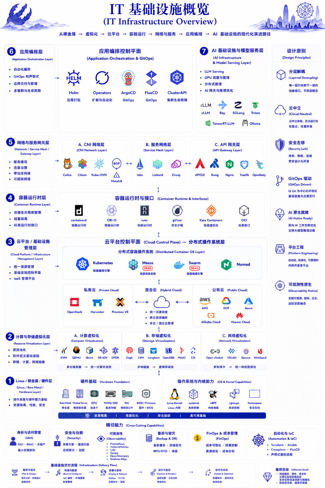

# 第 1 章：现代 IT 系统全景



## 本章概述

本章先回答一个现实问题：为什么现代 IT 最大的问题，越来越不是“功能不够”，而是“复杂度失控”。

业务部门看到的是增长、转化、收入和交付速度；基础 IT 团队看到的是稳定性、资源池、成本、风险和系统边界。双方并不是谁对谁错，而是在用不同语言描述同一个系统。现代基础设施的价值，就在于把业务结果和技术链路重新接起来，让复杂系统可以被抽象、被度量、被自动化、被治理。

## 1.1 现代 IT 基础设施不是组件清单

现代 IT 基础设施表面上是一组技术栈：从物理服务器、虚拟机到云原生系统；从存储、网络到数据库、监控和安全。但从技术史视角看，它真正承载的是企业对规模、速度、成本和风险的长期焦虑。它包括：

- **计算资源**：物理服务器、虚拟机、容器、函数计算
- **存储资源**：块存储、文件存储、对象存储、分布式存储
- **网络资源**：传统网络、软件定义网络（SDN）、CNI、Service Mesh
- **数据服务**：数据库、缓存、消息队列、数据湖、向量数据库
- **可观测性**：监控、日志、追踪、事件
- **安全体系**：IAM、RBAC、网络策略、零信任

## 1.2 从单机到云原生的演进

从单机到云原生，不是简单的部署方式升级，而是企业不断把控制权从个人经验中抽离出来的过程。单机时代依赖机器和人，虚拟化时代把资源抽象出来，容器时代把运行环境标准化，云原生时代则把系统状态交给控制面持续校正。

### 时代划分

| 时代 | 特征 | 代表技术 |
|------|------|----------|
| 物理机时代 | 独占硬件，手工管理 | 物理服务器、RAID、SAN |
| 虚拟化时代 | 资源池化，虚拟化管理 | VMware、KVM、Xen |
| 容器时代 | 轻量级隔离，快速部署 | Docker、Kubernetes |
| 云原生时代 | 声明式、自动化、弹性 | K8s、Service Mesh、GitOps |

### 关键演进节点

1. **虚拟化技术** - 从硬件虚拟化到操作系统虚拟化
2. **容器编排** - 从 Docker Swarm 到 Kubernetes 一统天下
3. **服务网格** - 从微服务到 Service Mesh
4. **GitOps** - 从 CI/CD 到声明式运维

## 1.3 系统分层架构

```
┌─────────────────────────────────────────────┐
│              应用层 (Application)            │
│  业务应用 │ Web 服务 │ API │ AI Agents       │
├─────────────────────────────────────────────┤
│              平台层 (Platform)               │
│  K8s │ Service Mesh │ API Gateway │ IDP     │
├─────────────────────────────────────────────┤
│              基础设施层 (Infrastructure)     │
│  计算 │ 存储 │ 网络 │ 数据库 │ 缓存          │
├─────────────────────────────────────────────┤
│              硬件层 (Hardware)               │
│  服务器 │ GPU │ 存储设备 │ 网络设备         │
└─────────────────────────────────────────────┘
```

## 1.4 核心能力体系

### 基础设施能力

- 计算资源管理
- 存储资源管理
- 网络资源管理
- 基础安全能力

### 平台能力

- 应用交付
- 运行时管理
- 可观测性
- 自动化运维

### 应用能力

- 业务逻辑
- 数据处理
- 用户交互
- 外部集成

## 1.5 从"组件堆叠"到"能力体系"

传统 IT 建设关注的是"买什么组件"，现代 IT 关注的是"需要什么能力"。

### 对比

| 维度 | 传统思维 | 现代思维 |
|------|----------|----------|
| 关注点 | 组件功能 | 业务能力 |
| 交付方式 | 手工部署 | 自动化交付 |
| 运维模式 | 被动响应 | 主动运营 |
| 扩展方式 | 垂直扩展 | 水平扩展 |
| 治理方式 | 分散管理 | 统一平台 |

## 1.6 基础设施演进：从 Cloud Native 到 AI Native

如果把过去二十多年的基础设施演进串起来看，它本质上一直在解决同一个问题：业务如何持续突破资源边界继续扩张。

从虚拟化、云计算，到 Kubernetes、云原生，再到今天的 AI Infra，表面上是技术栈不断更替，底层其实是资源抽象、统一调度、控制权迁移和数据面强化的连续升级。Kubernetes 的成功，并不只是容器编排，而是它第一次让大量企业把基础设施理解成一种“分布式操作系统”：声明期望状态，控制面持续校正，运行时负责执行，网络和存储通过标准接口接入。

但这也说明，Kubernetes 更像一个时代的中间层，而不是最终答案。现代基础设施路径越来越像 `Hardware -> Virtualization -> Cloud Control Plane -> Runtime -> Network -> Orchestration -> AI Infra`。Cloud Native 没有结束，它正在进入下一阶段：AI Native。

### 演进路径

```
硬件层 → 虚拟化层 → 云控制平面 → 运行时 → 网络 → 编排层 → AI 基础设施
   │           │             │          │       │        │         │
   ▼           ▼             ▼          ▼       ▼        ▼         ▼
 GPU/NVMe   Ceph/CSI      AWS       Docker   CNI     K8s     vLLM/Ray
 RDMA       Open vSwitch  OpenStack  OCI      eBPF   Kubelet  Triton
```

### 层次解析

| 层次 | 核心组件 | 关注点 |
|------|----------|--------|
| 硬件层 | GPU、NVMe、RDMA、Linux Kernel、eBPF、cgroups | 资源边界与性能上限 |
| 虚拟化层 | Ceph、Open vSwitch、SR-IOV、DPDK、CSI | 计算/存储/网络统一资源池化 |
| 云控制平面 | AWS、OpenStack、Harvester | 资源统一管理、调度、编排 |
| 运行时与网络 | containerd、CRI-O、OCI、CNI、eBPF、Service Mesh | 进程隔离、流量路径、数据面能力 |
| 容器编排 | Kubernetes | 分布式容器操作系统 |
| AI 基础设施 | vLLM、Ray、TensorRT-LLM、SGLang、Triton | GPU调度、分布式推理、模型路由 |

底层依然是硬件。GPU、NVMe、RDMA、高速网络、Linux Kernel、eBPF、cgroups，决定了资源边界与性能上限。AI 时代反而让硬件重新变重要，因为大模型训练和推理最终拼的是显存、带宽、通信、IO 和调度能力。

再往上，是资源虚拟化。它早已不只是 KVM/QEMU 这类计算虚拟化，而是计算、存储、网络的统一资源池化。Ceph、Open vSwitch、SR-IOV、DPDK、CSI，本质都是把离散硬件抽象成可调度资源池。

接下来是 Cloud Control Plane。AWS、OpenStack、Harvester 并不是底层虚拟化技术本身，而是资源控制平面，负责统一管理、调度和编排基础设施。它们把服务器、网络、存储和权限从设备操作变成 API 操作，也把基础设施的控制权从机器房间迁移到平台入口。

### Kubernetes 的中间层定位

Kubernetes 更像是时代的“中间层”，而非最终答案：

- **成功原因**：形成完整生态和事实标准，Mesos、Docker Swarm 逐渐退场
- **应用误区**：Kubernetes Everything——数据库跑 K8s、AI 跑 K8s、边缘跑 K8s、存储也跑 K8s
- **最终状态**：像 Linux 一样逐渐"下沉"，成为基础设施底座

Mesos、Docker Swarm 逐渐退场，是因为它们没能形成完整生态和事实标准。如今真正还健在、并成为行业默认答案的，只剩 Kubernetes。

但 Kubernetes 的成功，也带来了“Kubernetes Everything”的误区：数据库跑 K8s，AI 跑 K8s，边缘跑 K8s，虚拟机跑 K8s，存储也跑 K8s。最后很多企业发现，自己管理的不是业务，而是 Kubernetes 本身。

### AI 时代的基础设施重构

AI Infra 正在重新打破这个结构。传统 Web Infra 关注 HTTP 请求、副本、弹性和服务治理；AI Infra 更关心 GPU 调度、KV Cache、显存拓扑、分布式推理、模型路由、Token 延迟和多模型网关。

| 传统 Web 基础设施 | AI 基础设施 |
|-------------------|-------------|
| HTTP 请求 | Token 延迟 |
| 副本数 | GPU 调度 |
| 弹性伸缩 | KV Cache |
| 服务治理 | 显存拓扑 |
| API Gateway | 多模型网关 |

所以 vLLM、Ray、TensorRT-LLM、SGLang、Triton 正在崛起。它们解决的问题，已经不是传统 Kubernetes 最擅长的问题。

模型规模进入 30B、70B、100B+ 后，真正决定系统上限的，重新变成硬件利用率和高速通信能力。Kubernetes 不会消失，但它会更像 Linux 一样下沉为基础设施底座。真正继续向上演进的，会是 AI Gateway、Inference Fabric、GPU Scheduler、Semantic Cache、Agent Runtime 这些 AI Native 基础设施。

### 未来趋势

**向上生长的新层**：
- AI Gateway - AI 请求路由与负载均衡
- GPU Scheduler - 异构资源调度
- Inference Fabric - 推理服务网格
- Semantic Cache - 语义缓存
- Agent Runtime - Agent 执行时

> Cloud Native 没有结束，它正在进入下一阶段：**AI Native**

## 1.7 从一图系列到系统全景

“一图读懂”系列真正想解决的，不是把技术名词排列得更整齐，而是把技术背后的系统关系讲清楚。现代 IT 系统从来不是服务器、数据库、网络、监控、CI/CD 的简单相加。它更像一套不断扩张的运行体系：业务增长带来更多用户，更多用户带来更多请求，更多请求带来更多服务、数据、权限、告警和成本。技术复杂度最后会变成组织复杂度，组织复杂度又会反过来要求更强的平台能力。

从这个视角看，现代 IT 可以分成两条线。一条是用户能看见的明线：单机时代、网络时代、云上帝国、稳定性战争、重建信任、算力之争、AI Native。另一条是工程校准的暗线：Linux / 裸金属 / 硬件层，计算与存储虚拟化层，云平台与基础设施管理层，容器运行时层，网络与服务网关层，应用编排层，AI 基础设施与模型服务层。前者帮助读者理解时代变化，后者帮助工程师定位技术所在的系统层级。

这也是为什么第一季要从系统全景开始，而不是直接讲某个工具。工具会替换，平台会演进，开源项目会兴衰，但系统要解决的问题一直存在：资源如何被抽象，控制权如何被治理，复杂度如何被封装，故障如何被定位，权限如何被约束，成本如何被解释。真正成熟的基础设施团队，最后提供的不是一堆组件，而是一套能让业务持续运行的能力体系。

因此，本章承担的是全书地图的作用。后续每一章都可以回到这里重新定位：网络是数据面，数据库和存储是状态与数据流，监控是理解系统行为，DevOps 和平台工程是控制权迁移，安全与合规是重新建立信任。AI Native 只是把这条线继续往前推：当软件开始拥有记忆、工具调用和执行能力，基础设施也必须继续升级。

## 本章收束

读完本章，应该建立的不是“现代 IT 有哪些组件”的清单感，而是一个全局判断：基础设施演进的主线，是把不可控的人为操作、离散资源和局部经验，逐渐变成可复用、可治理、可审计的系统能力。

下一章进入网络与协议。因为当系统从单体走向分布式，最先被放大的不是代码复杂度，而是连接、延迟、路由、安全边界和数据面的复杂度。

- [Cloud Native Architecture](https://github.com/cncf/tag-cloud-architecture)
- [Kubernetes Documentation](https://kubernetes.io/docs/concepts/overview/)
- [Platform Engineering Guide](https://platformengineering.org/)
