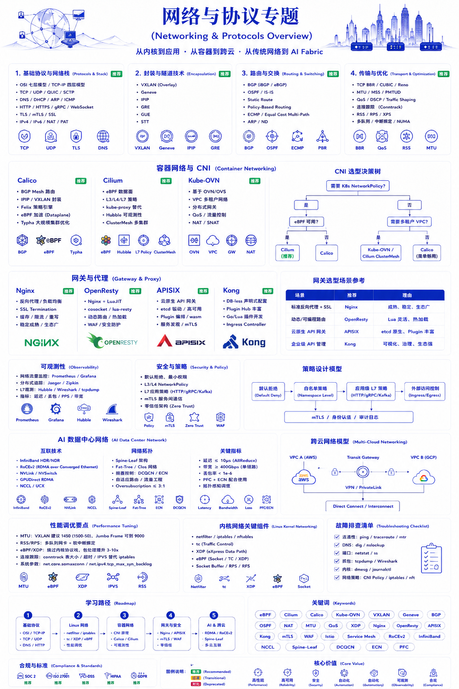

# 第 2 章：网络与协议



## 本章概述

本章的现实问题是：为什么网络不再只是“把服务连起来”，而越来越像一套系统控制机制。

在单体应用时代，网络像背景设施；到了微服务、Kubernetes、多云和 AI 数据中心时代，网络开始决定系统边界、故障传播、访问控制、流量治理和训练效率。网络复杂度的上升，本质上是业务从单进程、单机房走向分布式协作之后必然付出的代价。

## 2.1 协议栈基础

协议栈不是考试概念，而是理解系统边界的历史地图。每一层协议都在回答一个问题：数据如何从一个不可信、可能拥塞、可能丢包、可能跨地域的世界里，抵达另一个进程。

### OSI 七层模型

```
┌────────────────────────────────────────┐
│  7. 应用层 (Application)               │  ← HTTP, DNS, FTP, SSH
├────────────────────────────────────────┤
│  6. 表示层 (Presentation)              │  ← TLS, SSL, JPEG, GIF
├────────────────────────────────────────┤
│  5. 会话层 (Session)                   │  ← RPC, NetBIOS
├────────────────────────────────────────┤
│  4. 传输层 (Transport)                 │  ← TCP, UDP
├────────────────────────────────────────┤
│  3. 网络层 (Network)                   │  ← IP, ICMP, ARP
├────────────────────────────────────────┤
│  2. 数据链路层 (Data Link)             │  ← Ethernet, PPP, VLAN
├────────────────────────────────────────┤
│  1. 物理层 (Physical)                  │  ← 光纤, 电缆, WiFi
└────────────────────────────────────────┘
```

### TCP/IP 四层模型

| 层级 | 协议 | 设备 |
|------|------|------|
| 应用层 | HTTP, HTTPS, DNS, SSH | L7 Switch |
| 传输层 | TCP, UDP | L4 Switch |
| 网络层 | IP, ICMP | Router |
| 链路层 | Ethernet | Switch |

## 2.2 核心协议详解

### HTTP/HTTPS

- **HTTP/1.1**：持久连接、管道化、Chunked Transfer
- **HTTP/2**：多路复用、Header 压缩、Server Push
- **HTTP/3**：QUIC 协议、0-RTT 握手

### TLS/SSL

```
TLS 1.3 握手流程：
ClientHello → ServerHello → Key Share → Finished
                                    ↓
                           应用数据加密传输
```

### DNS

- **递归查询**：客户端 → 本地 DNS → 根 DNS → 顶级 DNS → 权威 DNS
- **GSLB**：全局负载均衡，基于地理位置解析
- **DoH/DoT**：DNS over HTTPS/TLS，隐私保护

## 2.3 Kubernetes 网络

### CNI (Container Network Interface)

| CNI 插件 | 特点 | 适用场景 |
|----------|------|----------|
| Calico | 高性能，BGP 支持 | 大规模集群 |
| Cilium | eBPF，安全性强 | 安全敏感场景 |
| Flannel | 简单易用 | 小规模集群 |
| Canal | Flannel + Calico | 通用场景 |

### Kubernetes 网络模型

- **Pod 网络**：每个 Pod 拥有唯一 IP，Pod 间直接通信
- **Service**：ClusterIP、NodePort、LoadBalancer、ExternalName
- **Ingress**：HTTP/HTTPS 入口路由

### 网络策略 (NetworkPolicy)

```yaml
apiVersion: networking.k8s.io/v1
kind: NetworkPolicy
metadata:
  name: api-allow
spec:
  podSelector:
    matchLabels:
      app: api
  ingress:
  - from:
    - podSelector:
        matchLabels:
          app: frontend
    ports:
    - protocol: TCP
      port: 8080
```

## 2.4 Service Mesh

### 服务网格架构

```
┌──────────────────────────────────────────────────┐
│                   Service Mesh                    │
├──────────────────────────────────────────────────┤
│  ┌─────────┐      ┌─────────┐      ┌─────────┐  │
│  │ Service │ ←──→ │  Data   │ ←──→ │ Service │  │
│  │   A     │      │  Plane  │      │   B     │  │
│  └─────────┘      └─────────┘      └─────────┘  │
│       ↑                ↑                ↑        │
│   ┌───────┐        ┌───────┐        ┌───────┐  │
│   │ Sidecar│        │ Sidecar│        │ Sidecar│  │
│   │ Proxy  │        │ Proxy  │        │ Proxy  │  │
│   └───────┘        └───────┘        └───────┘  │
└──────────────────────────────────────────────────┘
```

### 主流 Service Mesh 对比

| 方案 | 数据面 | 控制面 | 特点 |
|------|--------|--------|------|
| Istio | Envoy | Istiod | 功能最全，复杂度高 |
| Linkerd | Linkerd2 | Linkerd | 简单易用，资源占用低 |
| Cilium | Cilium | Cilium | eBPF 驱动，性能最佳 |

## 2.5 API Gateway

### 核心功能

- **路由**：基于 Path、Header、Query 参数
- **认证**：JWT、OAuth2、API Key
- **限流**：令牌桶、滑动窗口
- **熔断**：超时、重试、熔断器
- **转换**：协议转换、请求/响应转换

### 主流方案

- **Kong**：基于 Nginx，插件丰富
- **Envoy**：高性能，L7 代理
- **APISIX**：动态路由，云原生友好
- **Traefik**：自动服务发现

## 2.6 多云网络与 AI 数据中心

到了多云和 AI 数据中心，网络成本不再只是带宽费用，而是业务架构成本。跨云链路决定数据能否迁移，RDMA 与 NVLink 决定 GPU 是否能被喂饱，AI Fabric 决定训练和推理是否会被通信拖慢。

### 多云网络架构

```
┌─────────────────────────────────────────────────────────┐
│                    企业网络                              │
│                           │                              │
│              ┌────────────┼────────────┐                │
│              ↓            ↓            ↓                │
│        ┌─────────┐  ┌─────────┐  ┌─────────┐           │
│        │  AWS    │  │  Azure  │  │ GCP     │           │
│        │ VPC     │  │ VNet    │  │ VPC     │           │
│        └─────────┘  └─────────┘  └─────────┘           │
│              │            │            │                │
│              └────────────┼────────────┘                │
│                           ↓                             │
│                   云专线 / SD-WAN                       │
└─────────────────────────────────────────────────────────┘
```

### AI 数据中心网络

- **RDMA**：RoCE v2、iWARP、InfiniBand
- **NVLink**：GPU 间高速互联
- **NCCL**：NVIDIA Collective Communications Library
- **AI Fabric**：专门针对 AI 训练的网络架构

## 2.7 网络故障排查

### 排查工具

| 工具 | 用途 |
|------|------|
| ping | 连通性测试 |
| traceroute | 路由追踪 |
| netstat/ss | 端口和连接状态 |
| tcpdump | 抓包分析 |
| wireshark | 协议分析 |
| kubectl debug | K8s 网络调试 |

### 排查路径

1. **物理层**：网卡状态、网线、光模块
2. **链路层**：VLAN、MAC 地址、交换机
3. **网络层**：IP 配置、路由表、ACL
4. **传输层**：TCP/UDP 状态、防火墙
5. **应用层**：HTTP 状态码、DNS 解析

## 2.8 从连接系统到 AI Fabric

现代网络真正的变化，是它早已不只是“让机器互相连接”。最早的互联网网络更像运输系统：DNS 负责找到目的地，BGP 决定走哪条路，TCP 保证可靠传输，HTTP 让应用可以建立在互联网之上。那个时代的主流流量是南北向：用户访问网站，请求从公网进入数据中心，再返回终端。企业关心的是带宽、链路稳定性和网站能不能打开。

云计算和 Kubernetes 改变了这件事。越来越多流量不再来自用户，而来自系统内部。Pod 与 Pod、Service 与 Service、Cluster 与 Cluster 开始频繁通信，东西向流量快速增长。Overlay 网络由此成为常态，VXLAN、Geneve、GRE、IPIP 用封装换灵活性，让网络从物理交换机中抽象出来，进入软件可编排的数据面。但 Overlay 并不是免费的，封装会带来 MTU 损耗、CPU 消耗、PPS 压力和额外延迟。Web 业务还能容忍这些开销，AI 集群却很难容忍。

AI 让网络重新接近 HPC 问题。大模型训练和推理不是简单“多买 GPU”，而是持续发生高频分布式通信。NCCL、AllReduce、Tensor Parallel、Pipeline Parallel、KV Cache 同步都会消耗网络。模型规模进入 70B、100B+ 后，限制系统上限的经常不是 GPU FLOPS，而是网络带宽、延迟、拥塞控制和 GPU 等待时间。于是 RDMA、RoCEv2、InfiniBand、DPDK、GPUDirect RDMA 又重新变得重要。

这也是为什么 Linux Kernel、eBPF、XDP、Cilium 和 Envoy 会在现代网络中越来越关键。网络开始从“传输包”变成“理解流量”：请求属于哪个租户、哪个模型、哪个 Agent、什么优先级、是否可信、是否需要低延迟推理。未来 AI Infra 的竞争，很大一部分会变成数据面竞争。谁能让 GPU、模型、缓存、网关和 Agent 高效协同，谁就更接近下一代基础设施控制权。

## 本章收束

网络的演进说明了一件事：基础设施越分布式，真正重要的就越不是“有没有连接”，而是连接是否可治理、可观测、可隔离、可优化。CNI、Service Mesh、API Gateway、AI Fabric 都是在把连接能力升级为数据面能力。

下一章进入数据库。因为当连接把服务拆开之后，业务最深的焦虑会落到数据上：交易能否一致，分析能否实时，增长后的数据系统还能不能被理解和治理。

- [Kubernetes Networking](https://kubernetes.io/docs/concepts/cluster-administration/networking/)
- [Istio Documentation](https://istio.io/latest/docs/)
- [Cilium Documentation](https://docs.cilium.io/)
