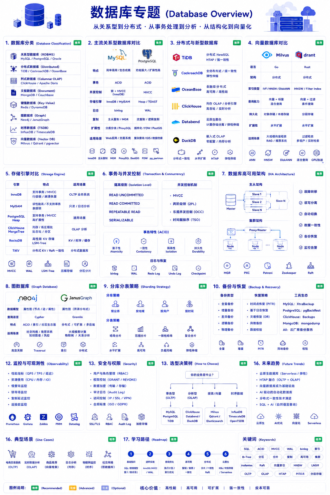

# 第 3 章：数据库系统



## 本章概述

本章介绍现代数据库技术，涵盖关系型数据库、分布式数据库、NewSQL、向量数据库等，以及数据库选型、事务、并发控制等核心概念。

## 3.1 数据库分类

### 按类型分类

```
┌─────────────────────────────────────────────────────────┐
│                     数据库类型                           │
├─────────────────────────────────────────────────────────┤
│  ┌─────────────┐ ┌─────────────┐ ┌─────────────┐       │
│  │ 关系型      │ │ 分布式      │ │ 列式存储    │       │
│  │ MySQL       │ │ TiDB        │ │ ClickHouse  │       │
│  │ PostgreSQL  │ │ CockroachDB │ │ Apache Druid│       │
│  │ Oracle      │ │ YugabyteDB  │ │ Snowflake   │       │
│  └─────────────┘ └─────────────┘ └─────────────┘       │
│  ┌─────────────┐ ┌─────────────┐ ┌─────────────┐       │
│  │ 文档数据库  │ │ Key-Value   │ │ 向量数据库  │       │
│  │ MongoDB     │ │ Redis       │ │ Milvus      │       │
│  │ CouchDB     │ │ etcd       │ │ Pinecone    │       │
│  │ Elastic     │ │ DynamoDB    │ │ Qdrant      │       │
│  └─────────────┘ └─────────────┘ └─────────────┘       │
│  ┌─────────────┐ ┌─────────────┐                       │
│  │ 图数据库    │ │ 时序数据库  │                       │
│  │ Neo4j       │ │ InfluxDB    │                       │
│  │ NebulaGraph │ │ TimescaleDB │                       │
│  └─────────────┘ └─────────────┘                       │
└─────────────────────────────────────────────────────────┘
```

### OLTP vs OLAP vs HTAP

| 类型 | 场景 | 特征 | 典型产品 |
|------|------|------|----------|
| OLTP | 事务处理 | 高并发、低延迟 | MySQL, PostgreSQL |
| OLAP | 分析处理 | 大数据量、复杂查询 | ClickHouse, Snowflake |
| HTAP | 混合负载 | 事务+分析一体化 | TiDB, SingleStore |

## 3.2 关系型数据库

### MySQL vs PostgreSQL

| 特性 | MySQL | PostgreSQL |
|------|-------|------------|
| 事务 | 支持 | 支持 |
| 复杂查询 | 一般 | 强大 |
| 扩展性 | 主从复制 | 分片、FDW |
| JSON 支持 | JSON 类型 | JSONB（原生） |
| 生态系统 | 丰富 | 丰富 |
| 适用场景 | Web 应用 | 企业级应用 |

### 核心概念

- **ACID**：原子性、一致性、隔离性、持久性
- **MVCC**：多版本并发控制
- **WAL**：预写日志
- **索引**：B+Tree、Hash、全文索引

## 3.3 分布式数据库

### 分布式架构

```
┌─────────────────────────────────────────────────────────┐
│                    分布式数据库架构                       │
├─────────────────────────────────────────────────────────┤
│                      SQL Layer                          │
│    (查询解析、优化、路由、事务协调)                       │
├──────────────┬──────────────┬──────────────┬───────────┤
│   Storage    │   Storage    │   Storage    │  Storage  │
│   Node 1     │   Node 2     │   Node 3     │  Node N   │
│  (TiKV)      │  (TiKV)      │  (TiKV)      │  (TiKV)   │
└──────────────┴──────────────┴──────────────┴───────────┘
```

### NewSQL 特性

- **水平扩展**：线性扩展存储和计算
- **强一致性**：分布式事务
- **高可用**：Raft 共识算法
- **SQL 兼容**：完整 SQL 支持

### 主流 NewSQL

| 数据库 | 特点 | 适用场景 |
|--------|------|----------|
| TiDB | MySQL 兼容，水平扩展 | 金融、游戏 |
| CockroachDB | PostgreSQL 兼容，全球分布 | 全球化应用 |
| YugabyteDB | PostgreSQL/Cassandra 兼容 | 多模态 |

## 3.4 向量数据库

### AI 时代的数据库

向量数据库专门用于存储和检索 Embedding 向量，支撑 RAG（检索增强生成）应用。

### 主流向量数据库

| 数据库 | 特点 | 索引算法 |
|--------|------|----------|
| Milvus | 开源，功能丰富 | HNSW, IVF |
| Pinecone | SaaS，性能高 | 专有 |
| Qdrant | Rust 实现，高性能 | HNSW |
| Weaviate | 图结构+向量 | HNSW |

### 向量检索流程

```
1. 数据导入
   文档 → 分词 → Embedding 模型 → 向量 → 存入向量数据库

2. 查询流程
   用户查询 → Embedding 模型 → 向量 → 向量数据库检索 → 返回结果
```

## 3.5 数据库高可用

### 主从复制

```
┌─────────┐     同步/异步     ┌─────────┐
│ Master  │ ───────────────→ │ Slave 1 │
│ (RW)    │                  │ (RO)    │
└─────────┘                  └─────────┘
       │
       └──────────────→ ┌─────────┐
                        │ Slave 2 │
                        │ (RO)    │
                        └─────────┘
```

### 多主架构

```
┌─────────┐              ┌─────────┐
│ Node A  │ ←──────────→ │ Node B  │
│ (RW)    │   双向同步   │ (RW)    │
└─────────┘              └─────────┘
       │                        │
       └────────┬───────────────┘
                ↓
          ┌─────────┐
          │ Node C  │
          │ (RW)    │
          └─────────┘
```

### 备份恢复

- **全量备份**：定期全量导出
- **增量备份**：Binlog 持续备份
- **PITR**：Point-in-Time Recovery

## 3.6 数据库选型决策树

```
开始
  │
  ├─ 是否需要事务？
  │    ├─ 是 → 关系型数据库
  │    │    ├─ 数据量 < 1TB → MySQL/PostgreSQL
  │    │    └─ 数据量 > 1TB → TiDB/CockroachDB
  │    │
  │    └─ 否 → 非关系型数据库
  │         ├─ 需要复杂查询 → Elasticsearch
  │         ├─ 需要高速缓存 → Redis
  │         ├─ 需要向量检索 → Milvus/Pinecone
  │         └─ 需要图关系 → Neo4j
  │
  └─ 是否需要分析能力？
       ├─ 是 → OLAP 数据库
       │    ├─ 实时分析 → ClickHouse/Druid
       │    └─ 数据湖 → Iceberg/Hudi
       │
       └─ 否 → 回到事务决策
```

## 学习目标

- [ ] 理解数据库分类和适用场景
- [ ] 掌握 MySQL 和 PostgreSQL 的区别
- [ ] 理解分布式数据库架构
- [ ] 能进行数据库选型

## 延伸阅读

- [TiDB Architecture](https://docs.pingcap.com/tidb/stable/architecture)
- [PostgreSQL Documentation](https://www.postgresql.org/docs/)
- [Vector Database Survey](https://arxiv.org/abs/2401.12581)
