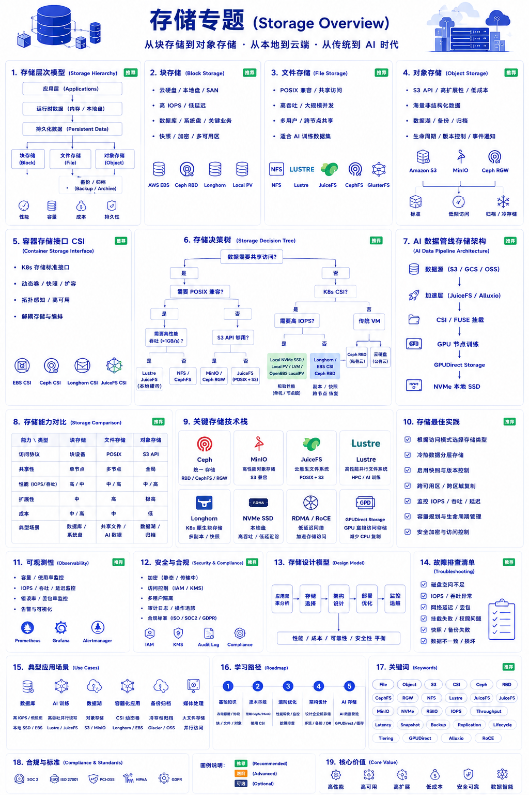

# 第 4 章：存储系统



## 本章概述

本章的现实问题是：为什么存储经常被低估，却总在系统规模真正变大时重新成为核心矛盾。

存储不是“把数据放起来”。它同时承载性能、容量、成本、可靠性、合规和生命周期。业务增长会制造更多数据，云计算会改变数据归属，AI 训练会放大吞吐和冷热分层压力。块存储、文件存储、对象存储、CSI 和数据湖仓，都是这些压力在不同阶段的工程答案。

如果把过去二十年的基础设施演进串起来看，存储的发展本质上也是一场资源抽象史。本地磁盘时代，数据绑定在单台服务器上；SAN/NAS 时代，存储从服务器里抽离出来，成为机房里的集中式基础设施；LVM、Thin Provision 和 Snapshot 让磁盘从物理设备变成逻辑卷；Ceph、GlusterFS、HDFS 又把离散磁盘抽象成统一存储池；云硬盘、对象存储、文件存储和归档存储则进一步把存储变成可计量、可复制、可跨区域消费的服务。

到了 Kubernetes 和 AI 时代，这条抽象链继续向上走。CSI、Rook、Longhorn、OpenEBS 让存储开始跟随工作负载生命周期编排；NVMe-oF、GPUDirect Storage、Checkpoint 和高速缓存层则把存储重新拉回吞吐、数据流和 GPU Feeding。传统数据库时代拼的是 IOPS，AI Storage 拼的是让 GPU 不等待 IO。昂贵的不只是 GPU，还有计算等待数据的时间。

## 4.1 存储类型分类

存储类型背后是访问模式的分化：数据库要低延迟块设备，共享计算要文件语义，互联网和 AI 数据湖要对象存储。不同访问模式决定了不同的成本结构和治理边界。

### 三大存储类型

| 类型 | 协议 | 特点 | 典型产品 |
|------|------|------|----------|
| 块存储 | iSCSI, FC | 低延迟、高IOPS | EBS, SAN, Ceph RBD |
| 文件存储 | NFS, SMB | 共享访问、层次结构 | EFS, NAS, GlusterFS |
| 对象存储 | S3, Swift | 海量、无结构、RESTful | S3, MinIO, OSS |

### 存储架构演进

```
传统存储 → 存储虚拟化 → 软件定义存储 → 云原生存储
   │             │              │            │
   ▼             ▼              ▼            ▼
 硬件阵列     统一存储       Ceph/MinIO   CSI + Rook
```

## 4.2 块存储

### 块存储特点

- **低延迟**：直接访问存储设备
- **高IOPS**：适合数据库、高性能计算
- **一致性**：强一致写入

### 主流块存储方案

| 方案 | 类型 | 特点 |
|------|------|------|
| EBS | 云服务 | AWS 云盘，高可用 |
| Ceph RBD | 分布式 | 统一存储平台 |
| Longhorn | 云原生 | K8s 原生，块存储 |
| Local PV | 本地存储 | 高性能，持久化 |

### Kubernetes 块存储

```yaml
apiVersion: v1
kind: PersistentVolumeClaim
metadata:
  name: mysql-pvc
spec:
  accessModes:
    - ReadWriteOnce
  storageClassName: longhorn
  resources:
    requests:
      storage: 10Gi
```

## 4.3 文件存储

### 文件存储特点

- **共享访问**：多节点同时读写
- **层次结构**：目录树组织
- ** POSIX 兼容**：标准文件系统接口

### NFS 在 Kubernetes 中的使用

```yaml
apiVersion: v1
kind: PersistentVolume
metadata:
  name: nfs-pv
spec:
  capacity:
    storage: 100Gi
  accessModes:
    - ReadWriteMany
  nfs:
    server: 192.168.1.100
    path: /data/shared
```

### 分布式文件系统

| 系统 | 特点 | 适用场景 |
|------|------|----------|
| GlusterFS | 弹性卷、开源 | 通用文件存储 |
| Lustre | HPC、高性能 | 超算、EDA |
| JuiceFS | 云原生、高性能 | AI 训练、大数据 |
| CephFS | 统一存储 | 综合场景 |

## 4.4 对象存储

### 对象存储架构

```
┌─────────────────────────────────────────────────────────┐
│                   对象存储架构                           │
├─────────────────────────────────────────────────────────┤
│                                                         │
│   ┌─────────┐     ┌─────────┐     ┌─────────┐         │
│   │  Client │     │  Client │     │  Client │         │
│   └────┬────┘     └────┬────┘     └────┬────┘         │
│        │               │               │               │
│        └───────────────┼───────────────┘               │
│                        ↓                                │
│              ┌─────────────────┐                        │
│              │   API Gateway   │                        │
│              │  (S3 Compatible)│                        │
│              └────────┬────────┘                        │
│                       │                                 │
│        ┌──────────────┼──────────────┐                 │
│        ↓              ↓              ↓                 │
│  ┌──────────┐   ┌──────────┐   ┌──────────┐           │
│  │  Meta    │   │  Data    │   │  Data    │           │
│  │  Store   │   │  Node    │   │  Node    │           │
│  │ (元数据) │   │ (数据块) │   │ (数据块) │           │
│  └──────────┘   └──────────┘   └──────────┘           │
│                                                         │
└─────────────────────────────────────────────────────────┘
```

### S3 API 常用操作

技术旁注：对象存储 API 不是本章主线，它只是说明对象存储如何把“文件系统语义”转成“面向海量非结构化数据的服务接口”。

```python
import boto3

s3 = boto3.client('s3')

# 上传对象
s3.upload_file('local.txt', 'my-bucket', 'remote.txt')

# 下载对象
s3.download_file('my-bucket', 'remote.txt', 'local.txt')

# 列出对象
response = s3.list_objects_v2(Bucket='my-bucket')

# 删除对象
s3.delete_object(Bucket='my-bucket', Key='remote.txt')
```

### 主流对象存储

| 产品 | 类型 | 特点 |
|------|------|------|
| MinIO | 开源 | S3 兼容，高性能 |
| Ceph | 开源 | 统一存储 |
| AWS S3 | 云服务 | 功能最全 |
| MinIO | 云服务 | SaaS 部署 |

## 4.5 Kubernetes 存储 (CSI)

### CSI 架构

```
┌─────────────────────────────────────────────────────────┐
│                    CSI 架构                             │
├─────────────────────────────────────────────────────────┤
│                                                         │
│   ┌─────────────────────────────────────────────────┐   │
│   │              CO (Kubernetes)                     │   │
│   │  • PV Controller                                 │   │
│   │  • CSI Driver Registrar                         │   │
│   └──────────────────────┬──────────────────────────┘   │
│                          │                               │
│   ┌──────────────────────┼──────────────────────────┐   │
│   │              CSI Driver                          │   │
│   │  ┌────────────────┐  ┌────────────────────────┐ │   │
│   │  │ CSI Plugin     │  │ CSI Sidecar            │ │   │
│   │  │ (Node Server)  │  │ (Attacher, Provisioner)│ │   │
│   │  └────────────────┘  └────────────────────────┘ │   │
│   └──────────────────────┬──────────────────────────┘   │
│                          │                               │
│                          ↓                               │
│   ┌─────────────────────────────────────────────────┐   │
│   │              Storage Backend                    │   │
│   │         (EBS, Ceph, NFS, etc.)                  │   │
│   └─────────────────────────────────────────────────┘   │
└─────────────────────────────────────────────────────────┘
```

### 常用 CSI 驱动

| 驱动 | 存储类型 | 特点 |
|------|----------|------|
| aws-ebs-csi-driver | AWS EBS | 云原生 |
| ceph-csi | Ceph | 统一存储 |
| nfs-csi | NFS | 通用 |
| longhorn-csi | Longhorn | 云原生块存储 |

## 4.6 备份与恢复

### 备份策略

```
┌─────────────────────────────────────────────────────────┐
│                   备份策略模型                           │
├─────────────────────────────────────────────────────────┤
│                                                         │
│  频率              数据保留              存储位置        │
│  ────             ──────────            ──────────     │
│  实时             1-7天                 本地            │
│  每小时           8-30天                对象存储        │
│  每天             1-12个月              冷存储          │
│  每周             >1年                  归档            │
│                                                         │
└─────────────────────────────────────────────────────────┘
```

### Kubernetes 备份方案

| 方案 | 类型 | 特点 |
|------|------|------|
| Velero | 集群备份 | 备份 K8s 资源 + PV |
| Restic | 文件备份 | 备份任意目录 |
| etcd backup | 元数据 | 备份集群状态 |

## 4.7 AI 数据管线存储架构

### AI 训练存储需求

```
数据管线：采集 → 清洗 → 训练 → 验证 → 部署

存储要求：
• 训练：高吞吐、顺序读 (TB/s)
• 缓存：低延迟、热点数据 (ms)
• 检查点：高可靠、增量写
• 数据湖：海量、非结构化
```

### AI 存储架构

```
┌─────────────────────────────────────────────────────────┐
│                AI 训练存储架构                           │
├─────────────────────────────────────────────────────────┤
│                                                         │
│  ┌─────────────┐    ┌─────────────┐    ┌─────────────┐│
│  │  数据湖     │───→│  缓存层     │───→│  GPU 存储   ││
│  │ (对象存储)  │    │ (内存/SSD)  │    │ (本地 NVMe) ││
│  └─────────────┘    └─────────────┘    └─────────────┘│
│       │                   │                  │         │
│       └───────────────────┴──────────────────┘         │
│                       ↓                                 │
│              ┌─────────────────┐                        │
│              │  分布式缓存     │                        │
│              │  (Alluxio/JuiceFS)                       │
│              └─────────────────┘                        │
└─────────────────────────────────────────────────────────┘
```

## 4.8 AI 时代存储从配角变成数据流系统

很多人以前会把存储理解成硬盘、NAS 或云盘，只要数据能放进去，问题似乎就结束了。但 AI 时代之后，存储第一次从“配角”重新变成基础设施核心。真正困难的问题不再只是数据能不能存下来，而是 GPU 能不能高速读取数据、训练任务能不能并行加载、Checkpoint 能不能快速保存、向量索引能不能低延迟查询，以及几十张甚至上百张 GPU 能不能同时吃到数据。

传统存储长期围绕事务型 IO 展开。RAID、SAN、NAS、数据库盘、云硬盘这些体系，核心关注 IOPS、随机读写、可靠性和高可用，因为数据库时代的数据模型主要是小事务和随机访问。AI 训练和推理改变了访问模式。图片、视频、Embedding、Checkpoint、训练集和向量索引会以更大的规模持续流动，系统开始从“随机 IO 世界”进入“吞吐世界”。很多 GPU 利用率低，并不一定是 GPU 不够，而是 GPU 在等待 IO。

这也解释了为什么块存储、对象存储和文件系统开始重新分工。块存储越来越偏向系统盘、本地缓存、高速临时数据和 Kubernetes CSI 持久卷；对象存储则成为海量非结构化数据和数据湖的默认底座，因为它容量大、成本低、天然分布式、适合横向扩展。但对象存储本身并不直接解决 GPU 高速读取，于是 JuiceFS、Lustre、CephFS、Alluxio 这类分布式文件系统和缓存层开始承担“让 GPU 更快吃到数据”的任务。

未来存储竞争很可能会变成数据路径竞争。NVMe、RDMA、RoCE、Spine-Leaf、GPUDirect Storage、冷热数据分层、分布式缓存和对象存储会共同构成 AI 数据流系统。真正强大的 AI Infra 不一定只有最大的模型，但一定要有高效的数据流。没有数据流，再强的 GPU 也会在等待中浪费。

## 本章收束

存储演进说明，数据一旦成为企业资产，就不再只是容量问题。真正的难点是访问模式、冷热分层、生命周期、跨区域复制、备份恢复、安全合规和 AI 训练吞吐之间的平衡。

下一章进入可观测性。因为当计算、网络、数据库和存储都变成分布式系统之后，企业最直接的焦虑会变成：系统到底发生了什么，谁能解释，谁能负责，谁能修复。

- [Kubernetes Storage Documentation](https://kubernetes.io/docs/concepts/storage/)
- [Ceph Documentation](https://docs.ceph.com/)
- [JuiceFS Documentation](https://juicefs.com/docs/)
