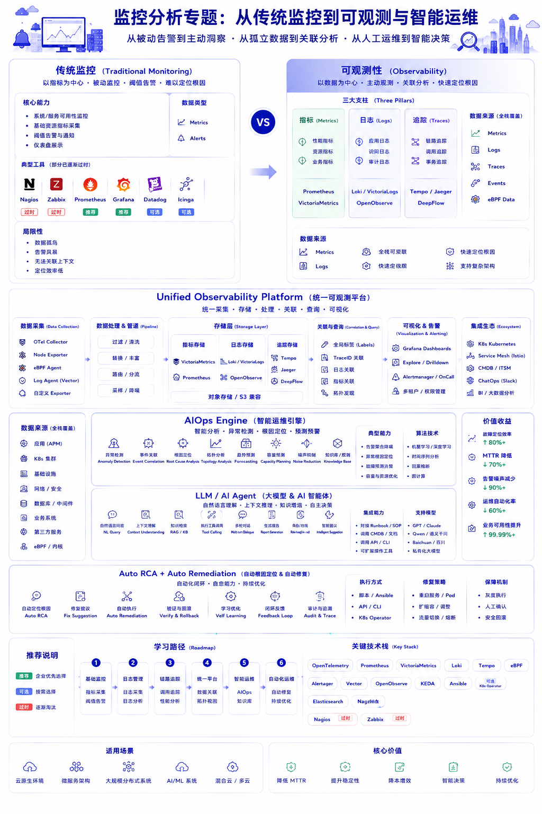

# 第 5 章：可观测性与监控

<!-- yitu-r2-assets:start -->

## 相关文章配图


<!-- yitu-r2-assets:end -->


## 本章概述

本章的现实问题是：为什么现代 IT 的难点，越来越从“部署系统”转向“解释系统”。

系统简单时，监控是看机器活没活；系统复杂后，监控变成一种组织治理能力。微服务、Kubernetes、多云、AI 任务和 Agent 工作流让故障链路变长，也让责任边界变模糊。可观测性不是更多图表，而是让系统重新变得可理解、可追责、可优化。

## 5.1 传统监控 vs 现代可观测性

很多人以为监控等于指标加告警。CPU 高了报警，内存满了报警，服务 Down 了报警，看板上出现红色曲线，运维团队就开始处理。

这确实是监控的起点，但它只是基础运维时代的答案。传统监控的核心逻辑非常简单：

```text
采集指标 -> 设置阈值 -> 触发告警
```

在单体应用、物理机和 VM 为主的阶段，这套逻辑基本有效。系统边界相对清楚，故障链路相对短，CPU、内存、磁盘、网络、进程状态和端口存活，通常就能解释大部分问题。Nagios、Zabbix、Cacti、Munin 这类工具，服务的正是这个时代。

但云原生之后，问题彻底变了。一个用户请求可能穿过 API Gateway、二十多个微服务、消息队列、Redis、数据库、向量数据库、模型服务和 LLM Agent。Kubernetes、Service Mesh、eBPF、GPU 集群、AI 推理服务把系统拆成了更长的链路，也把故障原因藏进了更多上下文里。

这时，传统监控只能告诉你：

> Something is wrong.

但现代系统真正需要回答的是：

> Why?

所以，从传统监控到可观测性，变化不只是工具换代，而是问题意识变了：过去问“哪里红了”，现在问“为什么会这样，它影响谁，下一步该怎么办”。

### 监控的三个时代

| 时代 | 核心问题 | 代表工具 / 能力 |
|------|------|------|
| 时代一：传统监控 | 机器和服务是否正常 | Nagios、Zabbix、Cacti、Munin |
| 时代二：应用性能监控 | 请求慢在哪里，链路断在哪里 | APM、Trace、Datadog、New Relic |
| 时代三：统一可观测性 | 指标、日志、链路和内核事件如何关联 | Prometheus、VictoriaMetrics、Loki、Tempo、OpenTelemetry、DeepFlow、OpenObserve |
| 时代四：AI Native Operations | AI 如何先分析、先定位、先修复，人类最后确认 | AIOps、LLM Ops、AI Observability、Agent Runtime |

### 可观测性的真正变化

可观测性不是把监控系统换成更贵的看板，而是从“监控已知问题”转向“探索未知问题”。

传统监控依赖人事先知道风险在哪里，然后配置阈值。CPU 超过 90%、磁盘超过 80%、接口错误率超过某个水位，就触发告警。这种模式适合已知故障，也适合结构稳定的系统。

现代可观测性面对的是未知故障。服务没有 Down，但用户体验变差；错误率没有明显升高，但某个区域的 P99 延迟突然抖动；GPU 利用率看起来很高，但 Token 吞吐并没有上来；Agent 调用了工具，但结果不符合业务意图。单个指标无法解释这些现象，必须把 Metrics、Logs、Traces、Events、Topology 和 eBPF 采集到的运行时事实统一关联起来。

真正重要的，已经不是单点指标，而是上下文。

### 传统监控的问题

- **指标割裂**：各系统独立采集，难以关联
- **缺乏上下文**：只知其然，不知其所以然
- **被动响应**：问题发生后才告警
- **无法预测**：无法预知潜在风险
- **难以解释行为**：只能看到状态异常，无法还原请求、依赖、权限、成本和调度关系

### 现代可观测性特性

- **统一数据模型**：Metrics、Logs、Traces 关联
- **全链路追踪**：请求全流程可见
- **根因分析**：快速定位问题根源
- **智能预测**：异常检测、趋势分析
- **运行时上下文**：通过 eBPF、拓扑和事件，把内核、网络、容器、服务和业务链路接起来

## 5.2 三大支柱

可观测性的基础仍然是 Metrics、Logs、Traces，但现代平台已经不再满足于“三大支柱”并列堆放。真正的能力来自关联：同一个请求的指标、日志、链路、事件、拓扑和运行时行为，必须能被放回同一条时间线里理解。

### Metrics（指标）

```
指标类型：
┌─────────────────────────────────────────────┐
│  Counter (计数器)                            │
│  只增不减，如：请求总数、错误数               │
├─────────────────────────────────────────────┤
│  Gauge (仪表)                                │
│  可增可减，如：CPU 使用率、内存使用量         │
├─────────────────────────────────────────────┤
│  Histogram (直方图)                          │
│  分布统计，如：响应时间、请求大小             │
├─────────────────────────────────────────────┤
│  Summary (摘要)                              │
│  分位统计，如：P50、P95、P99                 │
└─────────────────────────────────────────────┘
```

### Logs（日志）

```
日志级别：
DEBUG → INFO → WARN → ERROR → FATAL

结构化日志（JSON）：
{
  "timestamp": "2026-05-11T10:00:00Z",
  "level": "ERROR",
  "service": "api-gateway",
  "trace_id": "abc123",
  "message": "Request timeout",
  "duration_ms": 5000
}
```

### Traces（链路追踪）

```
分布式追踪示例：

api-gateway (span: abc123)
    │
    ├── span: abc123.1 ──→ user-service (span: abc123.1)
    │                         │
    │                         ├── span: abc123.1.1 ──→ database (span: abc123.1.1)
    │                         │                      (50ms)
    │                         │
    │                         └── span: abc123.1.2 ──→ cache (span: abc123.1.2)
    │                                              (10ms)
    │
    └── span: abc123.2 ──→ auth-service (span: abc123.2)
                             (20ms)
```

### eBPF 与运行时事件

Metrics、Logs、Traces 主要依赖应用、SDK、Agent 和采集管道。eBPF 则把观测能力推进到 Linux Kernel 和网络数据面附近，让平台可以在不大规模改造业务代码的情况下，看到连接、系统调用、网络包、容器关系和服务依赖。

这也是云原生可观测性的一次重要变化：过去排障依赖应用自己说清楚发生了什么；现在基础设施可以在运行时补齐一部分事实。它不能替代业务埋点，但能让平台在服务、容器、节点和网络之间建立更真实的上下文。

## 5.3 主流技术栈

### Prometheus + Grafana

```
┌─────────────────────────────────────────────────────────┐
│                  可观测性平台架构                         │
├─────────────────────────────────────────────────────────┤
│                                                         │
│    ┌─────────────┐     ┌─────────────┐                 │
│    │  Exporter   │     │  Exporter   │                 │
│    │  (Node)     │     │  (APP)      │                 │
│    └──────┬──────┘     └──────┬──────┘                 │
│           │                   │                         │
│           └─────────┬─────────┘                         │
│                     ↓                                   │
│            ┌────────────────┐                          │
│            │   Prometheus   │                          │
│            │   (时序数据库)  │                          │
│            └────────┬───────┘                          │
│                     │                                   │
│          ┌──────────┼──────────┐                       │
│          ↓          ↓          ↓                       │
│    ┌──────────┐ ┌──────────┐ ┌──────────┐            │
│    │ Grafana  │ │ AlertMgr │ │  API     │            │
│    │(可视化)  │ │ (告警)   │ │          │            │
│    └──────────┘ └──────────┘ └──────────┘            │
└─────────────────────────────────────────────────────────┘
```

### Loki + Tempo

| 组件 | 作用 | 特点 |
|------|------|------|
| Prometheus | Metrics | 时序数据库，高效存储 |
| Loki | Logs | 水平扩展，高效检索 |
| Tempo | Traces | 分布式追踪，低成本 |

### OpenTelemetry

```
OpenTelemetry 架构：

┌─────────────────────────────────────────────────────────┐
│                     OpenTelemetry                       │
├─────────────────────────────────────────────────────────┤
│                                                         │
│   ┌─────────────────────────────────────────────────┐  │
│   │                   SDKs                           │  │
│   │  Python │ Go │ Java │ Node.js │ .NET │ Rust    │  │
│   └─────────────────────────────────────────────────┘  │
│                         ↓                               │
│   ┌─────────────────────────────────────────────────┐  │
│   │              OTLP Exporter                       │  │
│   │     (OpenTelemetry Protocol)                    │  │
│   └─────────────────────────────────────────────────┘  │
│                         ↓                               │
│   ┌───────────────┐  ┌───────────────┐  ┌───────────┐ │
│   │ Prometheus    │  │     Loki      │  │   Tempo   │ │
│   │  Receiver     │  │   Receiver    │  │  Receiver │ │
│   └───────────────┘  └───────────────┘  └───────────┘ │
└─────────────────────────────────────────────────────────┘
```

## 5.4 统一可观测平台

统一可观测平台的目标，不是把所有数据倒进一个大仓库，而是让系统状态可以被关联、解释和治理。Prometheus、VictoriaMetrics、Loki、Tempo、OpenTelemetry、DeepFlow、OpenObserve 这些工具背后，指向的是同一个趋势：监控从单点工具走向统一观测平面。

### 数据采集层

- **Agent**：Prometheus Node Exporter、OTel Collector
- **SDK**：应用内埋点
- **自动注入**：Sidecar、eBPF

### 数据存储层

| 数据类型 | 存储方案 | 特点 |
|----------|----------|------|
| Metrics | Prometheus, Thanos, Mimir | 高压缩比，高查询性能 |
| Logs | Loki, Elasticsearch | 日志聚合，全文检索 |
| Traces | Tempo, Jaeger | 链路追踪，关联分析 |

### 数据应用层

- **可视化**：Grafana、Kibana
- **告警**：Alertmanager、Watcher
- **分析**：PromQL、LogQL、TraceQL
- **关联**：Trace ID、Service Map、Topology、Event Timeline

### 统一平台要回答的问题

| 问题 | 传统监控回答 | 统一可观测平台回答 |
|------|--------------|--------------------|
| 服务是否异常 | 某个指标超过阈值 | 哪条链路、哪个依赖、哪个变更触发了异常 |
| 用户是否受影响 | 接口错误率或机器状态 | 影响了哪些用户、区域、租户、模型或业务流程 |
| 成本是否失控 | 资源使用率升高 | 哪个服务、团队、模型或 Agent 行为造成成本变化 |
| 是否可以自动处理 | 触发告警，等待人处理 | 关联预案、风险级别、权限边界和回滚路径 |

## 5.5 AIOps

统一可观测平台带来了新的问题：数据太多了。TB/day 的日志、亿级 Metrics、百亿 Span、持续变化的服务拓扑和大量变更事件，已经超出人类手工分析能力。

于是 AIOps 开始出现。它不是让 AI 替代所有运维，而是把算法和模型放进排障链路，帮助人类完成异常检测、事件关联、根因定位、拓扑分析和容量预测。运维开始从“人盯 Dashboard”，逐渐变成“AI 辅助分析”。

### AIOps 架构

```
┌─────────────────────────────────────────────────────────┐
│                      AIOps 平台                          │
├─────────────────────────────────────────────────────────┤
│                                                         │
│   数据采集 ──→ 特征工程 ──→ 异常检测 ──→ 根因分析      │
│      ↑             ↑             ↑            ↑         │
│   Metrics      Logs         Traces       Events        │
│                                                         │
│                     ↓                                   │
│              自动修复 / 人工干预                         │
└─────────────────────────────────────────────────────────┘
```

### 核心能力

1. **异常检测**
   - 统计模型：3σ、IQR
   - 机器学习：LSTM、Transformer
   - 动态阈值

2. **根因分析 (RCA)**
   - 拓扑分析
   - 时序关联
   - 知识图谱

3. **自动修复**
   - 预案执行
   - 自动扩缩容
   - 流量切换

## 5.6 LLM/AI Agent 在运维中的应用

LLM 和 AI Agent 让运维继续向前走了一步。AIOps 更偏向检测、关联和预测，LLM/Agent 则开始进入理解、解释和执行链路。

这带来一个新的变化：未来真正需要被观测的，已经不只是系统本身，还包括 AI 本身。Prompt、Token、RAG、Memory、Agent 行为、Tool Calling、MCP、推理成本、幻觉率、越权调用和自动修复动作，都将成为可观测性的一部分。

### 智能运维场景

- **自然语言查询**：用自然语言查询系统状态
- **日志分析**：自动分析日志异常
- **告警收敛**：智能告警聚合
- **故障摘要**：自动生成故障报告
- **动作建议**：根据运行事实和 Runbook 生成修复方案
- **受控执行**：在权限、审批和回滚约束下执行低风险操作
- **AI 行为观测**：追踪 Prompt、Tool Calling、上下文、Token 和模型调用成本

### AI Agent 运维架构

```
┌─────────────────────────────────────────────────────────┐
│                   AI Agent 运维架构                      │
├─────────────────────────────────────────────────────────┤
│                                                         │
│   User ──→ Chat Interface ──→ Agent Controller         │
│                                       │                 │
│            ┌──────────────────────────┼───────────┐    │
│            ↓                          ↓           ↓    │
│     ┌─────────────┐           ┌─────────────┐ ┌──────┐│
│     │  Tool Kit   │           │  Knowledge  │ │ LLM  ││
│     │             │           │   Base      │ │      ││
│     │ - kubectl   │           │             │ │      ││
│     │ - promql    │           │ - Runbooks  │ │      ││
│     │ - logs      │           │ - Docs      │ │      ││
│     └─────────────┘           └─────────────┘ └──────┘│
└─────────────────────────────────────────────────────────┘
```

### 从看机器到理解 AI 行为

AI Native 时代的可观测性，正在形成新的对象体系：

| 观测对象 | 传统关注 | AI Native 关注 |
|----------|----------|----------------|
| 应用服务 | QPS、错误率、延迟 | 业务意图是否被正确完成 |
| 模型服务 | GPU 利用率、推理延迟 | Token 成本、上下文长度、模型路由、幻觉风险 |
| RAG 系统 | 数据库状态、检索耗时 | 召回质量、引用来源、向量库命中、知识新鲜度 |
| Agent | 进程是否运行 | 工具调用链路、权限边界、记忆使用、任务完成质量 |
| 自动修复 | 脚本执行结果 | AI 建议是否可信，动作是否可审计、可回滚 |

所以，监控正在从“看机器状态”，走向“理解系统行为”，再走向“AI Native Operations”。未来的运维体系会越来越像一个受控闭环：AI 先分析，AI 先定位，AI 给出修复建议或执行低风险动作，人类负责确认边界、授权高风险变更和复盘系统性问题。

## 5.7 从监控机器到理解 AI 行为

监控这个词在过去二十年里经历了几次含义变化。最早的基础运维时代，系统边界简单，监控的核心问题是机器有没有坏。CPU、内存、磁盘、端口、进程、服务存活和阈值告警就足以覆盖大部分场景。Nagios、Zabbix、Cacti、Munin 这些工具，本质上都在回答“资源是否异常”和“服务是否还活着”。

云原生之后，问题变成“为什么坏”。一个请求可能跨越 API Gateway、十几个微服务、MQ、Redis、数据库、对象存储、向量数据库、外部 API 和 LLM Agent。传统监控只能告诉你 Something is wrong，却很难解释 Why。于是 Metrics、Logs、Traces 开始融合，Prometheus、Loki、ELK、Jaeger、Tempo、SkyWalking 和 OpenTelemetry 共同推动行业从 Monitoring 进入 Observability。真正重要的已经不是单点指标，而是上下文：哪个 Span 慢了，哪个 Pod 重启了，哪个 SQL 阻塞了，哪个依赖导致了尾延迟。

但可观测性自身也带来了数据爆炸。现代企业每天可能产生 TB 级日志、亿级 Metrics 和海量 Trace，人类不可能继续靠盯 Dashboard 排障。AIOps 因此出现，用异常检测、事件关联、拓扑分析、根因定位和容量预测帮助团队从告警风暴中恢复判断力。这里的关键变化是，运维不再只是人看系统，而是系统辅助人理解系统。

LLM 和 Agent 时代又带来新的观测对象。Prompt 是否异常，Token 成本是否失控，RAG 检索是否偏移，Memory 是否污染，Agent 是否循环调用，Tool Calling 是否失败，模型是否幻觉，这些问题过去不属于传统监控范畴，却会直接影响业务结果。未来的运维体系会从 Monitoring 走向 Observability，再走向 AIOps 和 AI Native Operations。它不只是看机器状态，而是理解系统行为，进一步理解 AI 自身的运行行为。

## 本章收束

可观测性的演进说明，复杂系统不能只靠经验管理。指标、日志、链路、事件、拓扑、eBPF、知识库、AIOps 和 Agent 执行链路，正在把“排障经验”转化为企业级治理能力。

传统监控解决的是“哪里坏了”。现代可观测性解决的是“为什么坏了”。AI Native Operations 继续追问的是：系统能不能先理解异常、判断影响、给出修复路径，并在可审计、可授权、可回滚的边界内完成一部分动作。

下一章进入 DevOps 与平台工程。因为当系统已经可观测之后，企业会继续追问：能不能把重复操作、变更风险和交付控制权，也从个人经验中抽离出来。

- [OpenTelemetry Documentation](https://opentelemetry.io/docs/)
- [Grafana Labs](https://grafana.com/)
- [Observability Engineering](https://www.oreilly.com/library/view/observability-engineering/9781492076438/)
