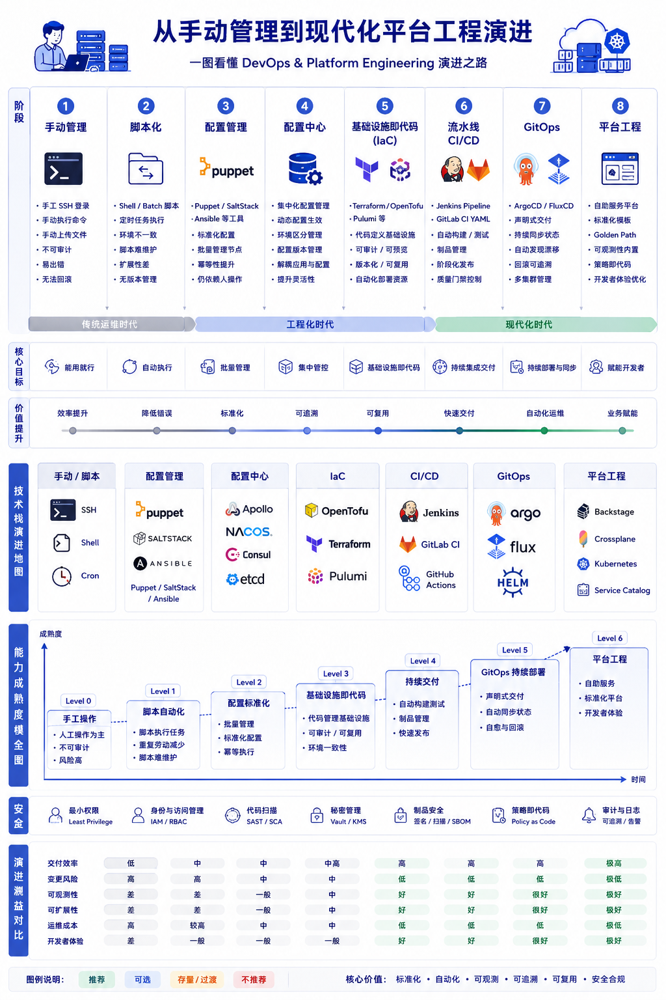

# 第 6 章：从手工管理到现代平台工程

<!-- yitu-r2-assets:start -->

## 相关文章配图


<!-- yitu-r2-assets:end -->


## 本章概述

本章的现实问题是：为什么技术复杂度背后，其实是一场控制权迁移。

手工运维时代，控制权在人手里；脚本化时代，控制权进入脚本；CI/CD 时代，控制权进入流水线；GitOps 时代，控制权进入 Git；平台工程时代，控制权被产品化，成为开发者可以自助使用、企业可以统一治理的内部能力。

## 6.1 运维演进历程

“一图看懂手工运维到现代平台工程的完整演进”背后，不是工具越来越先进，而是组织越来越无法承受不可重复、不可审计、不可回滚的人肉操作。

很多年轻工程师已经很难想象，早期基础设施几乎没有“平台”概念。那个时代上线靠 SSH 登录服务器，`scp` 上传文件，`vim` 改配置，最后手动 `restart` 服务。所有东西都依赖“老师傅经验”：谁知道哪台机器改过配置，谁记得线上跑了哪些版本，谁半夜救过火，谁知道哪个目录里的脚本不能删。系统可以运行，但很难证明自己为什么这样运行；可以靠人救回来，但很难审计、回滚和复现。

脚本化是第一次试图把重复劳动从人手里拿出来。Shell、Batch、Python、cron、批量执行工具把一部分动作固化下来，发布、备份、巡检、重启、日志清理都开始可以自动执行。但这个阶段很快进入另一种混乱：脚本越来越长，参数越来越多，环境越来越不一致，祖传 Shell 无人敢删。脚本能提升效率，却没有真正表达系统状态；它自动化的是“做什么动作”，不是“系统应该处于什么状态”。所以脚本化是自动化的起点，但还不是工程化的终点。

配置管理把基础设施推进到第二个阶段。Puppet、SaltStack、Ansible 这类工具第一次尝试把机器状态写成可描述配置：软件包应该安装什么版本，配置文件应该长什么样，服务应该是否启动，用户和权限应该如何存在。机器不再只是某个人手工维护出来的结果，而开始被一组可复用、可评审、可执行的声明描述。后来 Apollo、Nacos、Consul、etcd 这类配置中心继续把动态配置、服务发现和环境隔离拉进统一体系，应用状态和基础设施状态开始逐渐分层。

真正的分水岭，是 Terraform、OpenTofu、Pulumi 这类 IaC 工具出现之后。VPC、DNS、负载均衡、Kubernetes、IAM、安全组、数据库、对象存储这些过去只能在云控制台里手点的资源，开始进入 Git、PR Review、Diff、审计和回滚流程。基础设施第一次像应用代码一样拥有版本历史，也第一次可以在变更前回答：这次到底会新增什么、删除什么、修改什么。

再往后，CI/CD、GitOps 和平台工程把这条线继续推向工业化。Jenkins Pipeline、GitLab CI、GitHub Actions 让构建、测试、扫描、制品管理和发布流程进入 Pipeline as Code；Trivy、SBOM、Cosign、OIDC、SAST/SCA、Policy as Code 把安全治理前移到流水线；ArgoCD、FluxCD 又让系统从“CI 主动 push 发布”进入“集群从 Git 拉取期望状态并持续收敛”的阶段。最后，平台工程把 Kubernetes、CI/CD、RBAC、Terraform Module、Service Catalog、Golden Path 封装成开发者自助能力。开发者不再需要理解每一个底层细节，而是通过标准模板获得环境、权限、流水线和部署能力。

这条演进线越来越清晰：更少人工、更低权限、更强标准化、更高自动化、更好的开发者体验。平台工程不是“运维工具集合”，而是企业把复杂基础设施产品化之后形成的组织能力。

### 发展阶段

| 阶段 | 特征 | 工具 | 痛点 |
|------|------|------|------|
| 手工时代 | 人肉运维 | SSH, scp, vim, restart | 不可审计、不可回滚、不可复现 |
| 脚本时代 | 自动化重复动作 | Shell, Batch, Python, cron | 脚本膨胀、环境漂移、状态不可描述 |
| 配置管理 | 机器状态可描述 | Puppet, SaltStack, Ansible | 工具分散、应用配置和基础设施配置分层困难 |
| IaC | 基础设施进入 Git | Terraform, OpenTofu, Pulumi | 状态管理、模块治理和权限边界复杂 |
| CI/CD | 交付流程代码化 | Jenkins, GitLab CI, GitHub Actions | 流水线膨胀、安全和制品治理前移不足 |
| GitOps | 期望状态持续收敛 | ArgoCD, FluxCD | Git 状态、集群状态和回滚策略需要统一治理 |
| 平台工程 | 复杂度产品化 | IDP, Backstage, Service Catalog, Golden Path | 平台边界、开发者体验和治理责任需要长期运营 |

### 演进路线图

```
┌─────────────────────────────────────────────────────────────────┐
│                      运维能力演进                               │
├─────────────────────────────────────────────────────────────────┤
│                                                                 │
│  手工 → 脚本 → 配置管理 → IaC → CI/CD → GitOps → 平台工程    │
│   │       │          │         │       │         │             │
│   │       │          │         │       │         ▼             │
│   │       │          │         │       │    ┌─────────────┐    │
│   │       │          │         │       │    │ Golden Path │    │
│   │       │          │         │       │    │  自助服务   │    │
│   │       │          │         │       │    └─────────────┘    │
│   │       │          │         │       │                       │
│   └───────┴──────────┴─────────┴───────┴───────────────────────┘
│                                                                 │
│  效率 ↑                                                      │
│  复杂度 ↑                                                      │
└─────────────────────────────────────────────────────────────────┘
```

## 6.2 IaC (Infrastructure as Code)

IaC 的核心价值，从来不只是“自动创建资源”。它真正改变的是基础设施进入了软件工程体系：资源定义可以进 Git，变更可以做 Review，执行前可以看 Diff，故障后可以追溯，环境之间可以复用同一套模块。

这意味着基础设施状态不再只存在于某个云控制台、某个工单系统或某个工程师的记忆里。VPC、DNS、负载均衡、Kubernetes、IAM、安全组这些资源被写成代码之后，企业第一次有机会用应用工程的方法管理基础设施工程。

### 主流 IaC 工具对比

| 工具 | 类型 | 特点 | 适用场景 |
|------|------|------|----------|
| Terraform | 声明式 | 跨云，HCL 语言 | 多云基础设施 |
| OpenTofu | 声明式 | Terraform 分支 | 开源优先 |
| Pulumi | 声明式 | 代码化，主流语言 | 开发者友好 |
| Ansible | 过程式 | SSH，无状态 | 配置管理 |

### Terraform 工作流程

```
1. Write (编写)
   └─ main.tf → 定义基础设施

2. Init (初始化)
   └─ terraform init → 下载 Provider

3. Plan (计划)
   └─ terraform plan → 预览变更

4. Apply (应用)
   └─ terraform apply → 执行变更

5. Destroy (销毁)
   └─ terraform destroy → 清理资源
```

### 示例：AWS EKS 集群

技术旁注：下面的 IaC 示例用于说明“基础设施被代码化”后的表达方式。主线不是 Terraform 语法，而是资源状态开始脱离个人操作，进入可评审、可回滚、可追踪的工程流程。

```hcl
module "eks" {
  source  = "terraform-aws-modules/eks/aws"
  version = "~> 19.0"
  
  cluster_name    = "my-cluster"
  cluster_version = "1.28"
  
  vpc_id                         = module.vpc.vpc_id
  subnet_ids                     = module.vpc.private_subnets
  
  eks_managed_node_group_defaults = {
    ami_type = "AL2_x86_64"
  }
  
  eks_managed_node_groups = {
    primary = {
      name = "primary-node-group"
      
      instance_types = ["m5.large"]
      
      min_size     = 2
      max_size     = 5
      desired_size = 3
    }
  }
}
```

## 6.3 CI/CD

CI/CD 解决的是交付动作的工业化问题。它把构建、测试、扫描、制品管理、灰度发布和生产变更放进流水线，让交付不再依赖某个人在本地执行一串命令。

但流水线并不天然等于治理。随着企业规模扩大，流水线里会继续长出镜像扫描、SBOM、签名、OIDC、SAST/SCA、Policy as Code、审批和审计。DevSecOps 的意义不是多加几个安全工具，而是把安全和合规变成交付路径里的默认能力。

### CI/CD 流程

```
┌─────────┐    ┌─────────┐    ┌─────────┐    ┌─────────┐    ┌─────────┐
│  Code   │──→ │  Build  │──→ │  Test   │──→ │ Stage   │──→ │  Prod   │
│ Commit  │    │  编译   │    │  测试   │    │ 预发布  │    │ 生产    │
└─────────┘    └─────────┘    └─────────┘    └─────────┘    └─────────┘
     │              │             │             │              │
     ↓              ↓             ↓             ↓              ↓
  Git Hook    Docker Build   Unit Test    Integration    Canary
               Package       E2E Test     Smoke Test    Blue-Green
```

### 主流 CI/CD 工具

| 工具 | 类型 | 特点 | 适用场景 |
|------|------|------|----------|
| Jenkins | 自托管 | 插件丰富，灵活 | 大型企业 |
| GitLab CI | 自托管/GitLab | 与 Git 深度集成 | GitLab 用户 |
| GitHub Actions | SaaS | 生态丰富，易用 | GitHub 用户 |
| ArgoCD | GitOps | 声明式，K8s 原生 | K8s 部署 |

## 6.4 GitOps

GitOps 进一步改变了控制权入口。传统 CI/CD 往往是流水线主动把变更推向环境；GitOps 则把 Git 里的期望状态变成系统的可信源，由集群里的控制器持续观察实际状态、发现漂移、执行同步和回滚。

所以 GitOps 改变的不是“用不用 ArgoCD”这个工具选择，而是谁拥有系统状态。Git 不再只是代码仓库，而变成基础设施期望状态的入口；控制器不再只是发布工具，而变成持续校正系统的运行时机制。

### GitOps 核心概念

```
┌─────────────────────────────────────────────────────────┐
│                      GitOps 流程                         │
├─────────────────────────────────────────────────────────┤
│                                                         │
│   ┌─────────────┐       ┌─────────────┐                │
│   │   Git Repo  │       │  Git Repo   │                │
│   │ (Desired    │       │ (Actual     │                │
│   │   State)    │       │   State)    │                │
│   └──────┬──────┘       └──────┬──────┘                │
│          │                     │                        │
│          │  Pull               │  Observe               │
│          ↓                     ↓                        │
│   ┌──────────────────────────────────────────────┐     │
│   │              GitOps Controller                │     │
│   │  (ArgoCD / Flux)                              │     │
│   │                                               │     │
│   │  Compare: Desired vs Actual                  │     │
│   │  Diff: kubectl apply -f manifest             │     │
│   └──────────────────────┬───────────────────────┘     │
│                          │                              │
│                          ↓                              │
│                  ┌──────────────┐                       │
│                  │ Kubernetes   │                       │
│                  │   Cluster    │                       │
│                  └──────────────┘                       │
└─────────────────────────────────────────────────────────┘
```

### ArgoCD 示例

技术旁注：GitOps 示例用于说明“期望状态”如何成为控制权入口。真正改变的不是发布按钮，而是谁定义状态、谁校正状态、谁审计状态。

```yaml
apiVersion: argoproj.io/v1alpha1
kind: Application
metadata:
  name: my-app
  namespace: argocd
spec:
  project: default
  source:
    repoURL: https://github.com/myorg/my-app
    targetRevision: HEAD
    path: deploy/overlays/prod
  destination:
    server: https://kubernetes.default.svc
    namespace: production
  syncPolicy:
    automated:
      prune: true
      selfHeal: true
```

## 6.5 平台工程

### 平台工程定义

> 平台工程是构建和运营内部开发者平台的学科，目标是优化开发者体验，加快业务价值交付。

如果说 IaC 让基础设施进入 Git，CI/CD 让交付进入流水线，GitOps 让期望状态持续收敛，那么平台工程就是把这些能力封装成开发者可以自助使用、企业可以统一治理的产品。

平台工程的目标不是让每个开发者都理解 Kubernetes、RBAC、Terraform Module、Service Mesh、镜像签名和发布策略，而是把这些复杂度沉淀为 Golden Path。开发者通过模板创建服务，通过服务目录理解依赖，通过标准流水线完成构建和发布，通过平台内置的权限、审计、策略和观测能力进入生产环境。

### 核心组件

```
┌─────────────────────────────────────────────────────────┐
│                  平台工程架构                            │
├─────────────────────────────────────────────────────────┤
│                                                         │
│   ┌─────────────────────────────────────────────────┐  │
│   │              Developer Portal                    │  │
│   │  (Backstage / Port / Gatsby)                    │  │
│   └──────────────────────┬──────────────────────────┘  │
│                          │                               │
│   ┌──────────────────────┼──────────────────────────┐  │
│   │                      │                          │  │
│   ↓                      ↓                          ↓  │
│┌──────────┐      ┌──────────────┐       ┌──────────┐ │
││ 应用模板  │      │  服务目录    │       │ 资源目录 │ │
││ (Cookiecutter│     │ (Service    │       │(Infra    │ │
││ / Templater)│     │  Catalog)   │       │ Catalog) │ │
│└──────────┘      └──────────────┘       └──────────┘ │
│      │                  │                    │        │
│      └──────────────────┼────────────────────┘        │
│                         ↓                              │
│              ┌─────────────────────┐                  │
│              │   Platform Core     │                  │
│              │   (Backstage API)   │                  │
│              └──────────┬──────────┘                  │
│                         │                              │
│    ┌────────────────────┼────────────────────┐        │
│    ↓                    ↓                    ↓        │
│┌─────────┐        ┌─────────┐         ┌─────────┐    │
││ GitOps  │        │  IaC    │         │ Service │    │
││ (ArgoCD)│        │(Terraform)        │ Mesh    │    │
│└─────────┘        └─────────┘         └─────────┘    │
│                                                         │
└─────────────────────────────────────────────────────────┘
```

### 平台工程成熟度模型

| 级别 | 特征 | 描述 |
|------|------|------|
| L0 | 手工 | 无标准，纯手工操作 |
| L1 | 标准化 | 有限模板，文档驱动 |
| L2 | 自动化 | CI/CD 自动化，自助服务 |
| L3 | 平台化 | 统一门户，多能力集成 |
| L4 | 智能化 | 智能推荐，预测性运维 |

## 6.6 控制权迁移

### 平台工程改变的是控制权

```
传统模式：
  业务 → 提需求 → 运维/平台 → 交付
  (被动响应，依赖人工)

平台工程模式：
  业务 → 自助平台 → 自动化交付
  (主动自助，标准化+自动化)

关键变化：
- 从"人治"到"法治"
- 从"审批"到"自助"
- 从"定制"到"标准"
- 从"运维驱动"到"开发者驱动"
```

## 6.7 平台工程为什么不是工具团队

平台工程不是突然出现的新概念，而是基础设施复杂度长期积累后的结果。早期上线靠 SSH、scp、vim 和手动 restart，所有系统状态都依赖人的记忆。后来脚本化减少了重复劳动，但也制造了新的混乱：脚本越来越长，环境越来越漂移，祖传 Shell 无人敢删。这个阶段只能叫自动化初级阶段，它提升了效率，却没有真正让系统可审计、可复现、可治理。

配置管理和 IaC 才让基础设施正式进入工程化。Puppet、Chef、SaltStack、Ansible 把机器状态变成可描述配置，Terraform、OpenTofu、Pulumi 则把 VPC、DNS、负载均衡、Kubernetes、IAM、安全组这些过去只能手点控制台的资源带进 Git。基础设施第一次拥有版本管理、Review、Diff、审计、回滚和环境一致性。IaC 的价值不是“自动创建资源”，而是让基础设施接受软件工程方法的约束。

CI/CD、GitOps 和 DevSecOps 继续推动控制权迁移。Jenkins、GitLab CI、GitHub Actions 把构建、测试、扫描、制品和发布流程代码化；ArgoCD、FluxCD 让集群主动从 Git 拉取期望状态，发现漂移并持续收敛。Git 不再只是代码仓库，而逐渐成为基础设施的事实来源。平台团队真正要做的，是把这些复杂能力封装成开发者可自助使用的 Golden Path。

所以平台工程不是“运维换个名字”，也不是“造一个工具门户”。它的目标是把复杂度产品化：开发者通过模板获得环境、权限、流水线、部署、监控和审计能力，而不是直接面对 Kubernetes、Terraform、RBAC、Service Mesh 和安全策略。AI 时代之后，这条线还会继续延伸。未来平台交付的不只是 Namespace，而可能是 GPU 配额、模型权限、推理网关、Agent Workflow 和 RAG Pipeline。

## 本章收束

DevOps 到平台工程的演进说明，自动化不是终点，控制权产品化才是关键。企业最终需要的不是更多脚本，而是一套能稳定交付、持续校正、降低认知负担的平台能力。

下一章进入平台工程核心能力。因为当控制权进入平台后，真正的问题变成：平台如何设计边界、身份、模板、目录、审计和开发者体验，让复杂度被组织长期承接。

- [Platform Engineering Guide](https://platformengineering.org/)
- [ArgoCD Documentation](https://argo-cd.readthedocs.io/)
- [Backstage Documentation](https://backstage.io/docs/)
