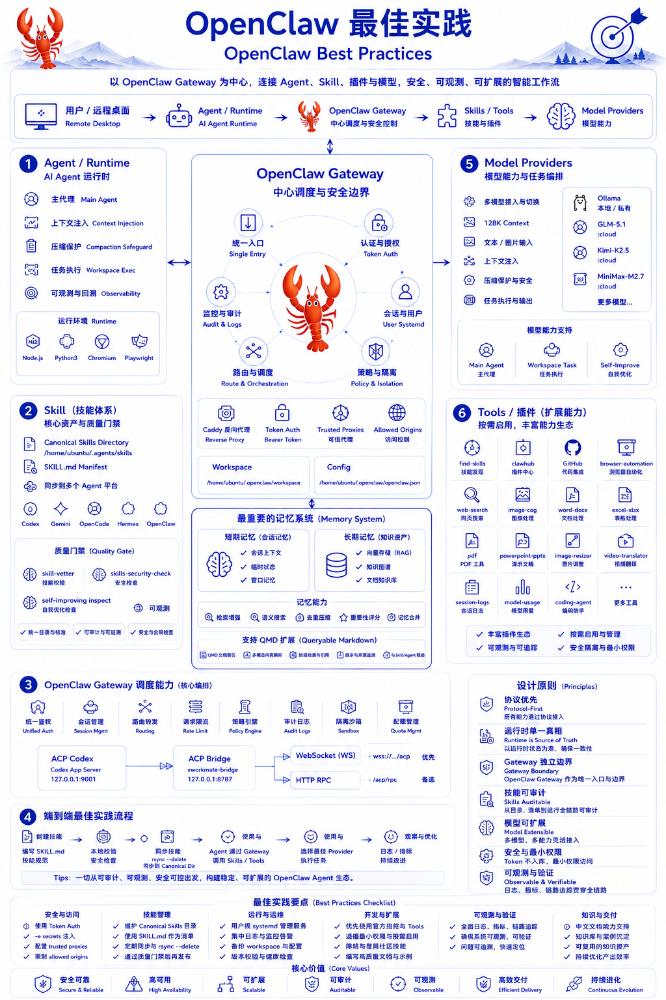

# 第 8 章：OpenClaw 最佳实践

<!-- yitu-r2-assets:start -->

## 相关文章配图


<!-- yitu-r2-assets:end -->


## 本章概述

本章介绍 OpenClaw Gateway 的架构设计、核心组件、最佳实践，以及如何构建 AI Agent 工程能力。

## 8.1 OpenClaw Gateway 定位

### 什么是 OpenClaw

OpenClaw 是一个开源的 AI Agent 网关和运行时平台，专注于：
- **多模型统一接入**：支持主流 LLM 提供商
- **工具调用**：Agent 与外部系统交互
- **技能系统**：可扩展的能力封装
- **安全边界**：完整的权限控制和审计

### 核心价值

```
┌─────────────────────────────────────────────────────────┐
│                  OpenClaw 核心价值                      │
├─────────────────────────────────────────────────────────┤
│                                                         │
│  ┌─────────┐  ┌─────────┐  ┌─────────┐  ┌─────────┐   │
│  │ 多模型  │  │  工具   │  │  技能   │  │  安全   │   │
│  │ 统一接入 │  │ 调用框架 │  │ 管理系统 │  │  边界   │   │
│  └────┬────┘  └────┬────┘  └────┬────┘  └────┬────┘   │
│       └────────────┴────────────┴────────────┘        │
│                         │                              │
│                         ↓                              │
│              ┌─────────────────────┐                  │
│              │  AI Agent Runtime   │                  │
│              │   & Gateway         │                  │
│              └─────────────────────┘                  │
└─────────────────────────────────────────────────────────┘
```

## 8.2 架构设计

### 整体架构

```
┌─────────────────────────────────────────────────────────┐
│                    OpenClaw 架构                        │
├─────────────────────────────────────────────────────────┤
│                                                         │
│  ┌──────────────────────────────────────────────────┐  │
│  │                  User Interface                   │  │
│  │   WebChat │ Telegram │ Slack │ Discord │ Signal   │  │
│  └──────────────────────────────────────────────────┘  │
│                         │                               │
│                         ↓                               │
│  ┌──────────────────────────────────────────────────┐  │
│  │              Gateway (网关层)                     │  │
│  │  • HTTP/WS 协议转换                                │  │
│  │  • 认证 & 授权                                    │  │
│  │  • 会话管理                                       │  │
│  │  • 限流 & 熔断                                    │  │
│  └──────────────────────────────────────────────────┘  │
│                         │                               │
│                         ↓                               │
│  ┌──────────────────────────────────────────────────┐  │
│  │            Agent Runtime (运行时)                 │  │
│  │                                                      │  │
│  │  ┌──────────┐  ┌──────────┐  ┌──────────┐        │  │
│  │  │  Skill   │  │  Tools   │  │ Memory   │        │  │
│  │  │  技能    │  │  工具    │  │  记忆    │        │  │
│  │  └──────────┘  └──────────┘  └──────────┘        │  │
│  │       │              │              │              │  │
│  │       └──────────────┼──────────────┘              │  │
│  │                      ↓                             │  │
│  │              ┌─────────────┐                       │  │
│  │              │  LLM Core   │                       │  │
│  │              └─────────────┘                       │  │
│  └──────────────────────────────────────────────────┘  │
│                         │                               │
│                         ↓                               │
│  ┌──────────────────────────────────────────────────┐  │
│  │           Model Providers (模型层)                │  │
│  │   OpenAI │ Anthropic │ Gemini │ DeepSeek │ Local  │  │
│  └──────────────────────────────────────────────────┘  │
│                                                         │
└─────────────────────────────────────────────────────────┘
```

### 核心组件

| 组件 | 作用 | 说明 |
|------|------|------|
| Gateway | 网关 | 协议转换、认证、会话管理 |
| Agent Runtime | 运行时 | 执行 Agent 逻辑 |
| Skill | 技能 | 封装好的能力单元 |
| Tool | 工具 | 外部系统集成 |
| Memory | 记忆 | 对话历史、知识存储 |
| Model Provider | 模型接入 | 多模型统一抽象 |

## 8.3 Skill 系统

### Skill 定义

Skill 是 OpenClaw 中的能力封装单元，每个 Skill 包含：
- **入口**：处理特定类型的请求
- **工具**：可调用的能力
- **记忆**：持久化上下文

### Skill 示例

```yaml
# skill.yaml
name: cloud-infrastructure
version: 1.0.0

description: 云基础设施管理技能

triggers:
  - pattern: ".*(创建|删除|查询).*(服务器|VM|容器).*"
    type: regex

tools:
  - name: create_server
    handler: ./handlers/cloud.py
    params:
      provider: required
      instance_type: required
      
  - name: delete_server
    handler: ./handlers/cloud.py
    
  - name: list_servers
    handler: ./handlers/cloud.py

permissions:
  - cloud:read
  - cloud:write
```

## 8.4 Tools 工具系统

### 工具类型

| 类型 | 描述 | 示例 |
|------|------|------|
| HTTP | 外部 API 调用 | curl, fetch |
| Exec | 本地命令执行 | bash, python |
| Browser | 浏览器控制 | playwright, selenium |
| File | 文件操作 | read, write, edit |
| Database | 数据库操作 | query, execute |
| Message | 消息发送 | email, slack, telegram |

### 工具定义

```yaml
tools:
  # HTTP 调用工具
  - name: http_request
    type: http
    config:
      timeout: 30000
      retry: 3
      
  # 执行命令工具
  - name: exec_command
    type: exec
    config:
      shell: /bin/bash
      timeout: 60000
      allowed_commands:
        - kubectl
        - docker
        - terraform
      
  # 浏览器工具
  - name: browser_control
    type: browser
    config:
      headless: false
      viewport:
        width: 1920
        height: 1080
```

## 8.5 Memory System

### 记忆类型

```
┌─────────────────────────────────────────────────────────┐
│                    Memory 层次                          │
├─────────────────────────────────────────────────────────┤
│                                                         │
│  ┌─────────────────────────────────────────────────┐   │
│  │              Long-term Memory                    │   │
│  │  (持久化知识，可跨会话)                           │   │
│  │  • 用户画像 • 技能知识 • 项目上下文              │   │
│  └─────────────────────────────────────────────────┘   │
│                         ↑                               │
│  ┌─────────────────────────────────────────────────┐   │
│  │              Session Memory                      │   │
│  │  (当前会话上下文)                                │   │
│  │  • 对话历史 • 任务进度 • 中间状态                │   │
│  └─────────────────────────────────────────────────┘   │
│                         ↑                               │
│  ┌─────────────────────────────────────────────────┐   │
│  │              Working Memory                      │   │
│  │  (即时工作区)                                    │   │
│  │  • 当前Prompt • 工具参数 • 生成内容             │   │
│  └─────────────────────────────────────────────────┘   │
│                                                         │
└─────────────────────────────────────────────────────────┘
```

### QMD 扩展

OpenClaw 支持 QMD (Question Markdown) 格式，实现结构化对话：

```markdown
# 我的云计算问题

## 问题背景
我想了解如何在 Kubernetes 中配置 Ingress。

## 我的理解
Ingress 是 K8s 的 HTTP 路由对象。

## 我的疑问
1. 如何配置 TLS 终止？
2. 如何实现灰度发布？

## 期待的回答
希望给出完整的配置示例和最佳实践。
```

## 8.6 安全与权限

### 安全架构

```
┌─────────────────────────────────────────────────────────┐
│                   安全边界设计                          │
├─────────────────────────────────────────────────────────┤
│                                                         │
│  1. 认证 (Authentication)                               │
│     • Token 认证                                        │
│     • OAuth2 / SAML                                     │
│     • 多因素认证                                        │
│                                                         │
│  2. 授权 (Authorization)                                │
│     • RBAC 角色                                         │
│     • 权限细粒度控制                                    │
│     • 技能级权限                                        │
│                                                         │
│  3. 审计 (Audit)                                        │
│     • 完整操作日志                                      │
│     • 敏感数据脱敏                                      │
│     • 合规报告生成                                      │
│                                                         │
│  4. 边界 (Boundary)                                     │
│     • 工具执行白名单                                    │
│     • 命令行限制                                        │
│     • 网络访问控制                                      │
│                                                         │
└─────────────────────────────────────────────────────────┘
```

### 权限模型

```yaml
# rbac.yaml
roles:
  admin:
    permissions:
      - "*"
      
  developer:
    permissions:
      - skill:read
      - skill:execute
      - tool:execute
      - memory:read
      - memory:write
      
  viewer:
    permissions:
      - skill:read
      - memory:read

users:
  - username: alice
    role: admin
    
  - username: bob
    role: developer
```

## 8.7 最佳实践

### 开发规范

1. **Skill 设计**
   - 单一职责：一个 Skill 只做一件事
   - 清晰触发：明确的触发条件
   - 最小权限：只请求需要的权限

2. **工具封装**
   - 幂等性：重复执行结果一致
   - 超时控制：设置合理的超时时间
   - 错误处理：返回有意义的错误信息

3. **安全实践**
   - 敏感数据不上传
   - 命令行最小化
   - 定期审计日志

### 部署架构

```
┌─────────────────────────────────────────────────────────┐
│                 生产环境部署架构                         │
├─────────────────────────────────────────────────────────┤
│                                                         │
│              ┌─────────────────────┐                   │
│              │    Load Balancer    │                   │
│              └──────────┬──────────┘                   │
│                         │                               │
│         ┌───────────────┼───────────────┐              │
│         ↓               ↓               ↓              │
│  ┌────────────┐  ┌────────────┐  ┌────────────┐       │
│  │ Gateway 1  │  │ Gateway 2  │  │ Gateway 3  │       │
│  │  (Active)  │  │  (Active)  │  │  (Active)  │       │
│  └────────────┘  └────────────┘  └────────────┘       │
│         │               │               │              │
│         └───────────────┼───────────────┘              │
│                         │                               │
│                         ↓                               │
│              ┌─────────────────────┐                   │
│              │   Redis (Session)   │                   │
│              └─────────────────────┘                   │
│                         │                               │
│                         ↓                               │
│              ┌─────────────────────┐                   │
│              │   PostgreSQL        │                   │
│              │   (持久化数据)      │                   │
│              └─────────────────────┘                   │
│                                                         │
└─────────────────────────────────────────────────────────┘
```

## 学习目标

- [ ] 理解 OpenClaw Gateway 架构
- [ ] 掌握 Skill 和 Tool 的开发
- [ ] 理解 Memory System 设计
- [ ] 能构建安全的 AI Agent 系统

## 延伸阅读

- [OpenClaw Documentation](https://docs.openclaw.ai/)
- [OpenClaw GitHub](https://github.com/openclaw/openclaw)
- [Agent Design Patterns](https://www.anyscale.com/blog)
