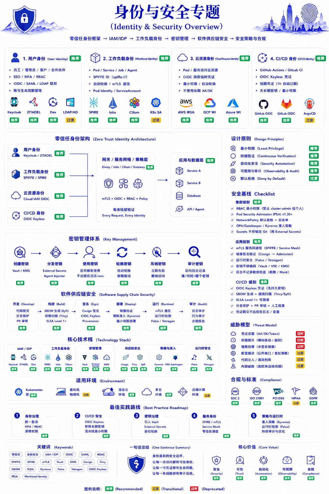

# 第 10 章：安全与合规



## 本章概述

本章从《一图纵览账户与安全体系》的主线展开：现代安全最大的变化，不是防火墙更厚，而是安全边界从“网络边界”迁移到“身份边界”。

真正完整的现代身份安全，是一套从用户身份、工作负载身份、云资源身份、CI/CD 身份，到密钥、策略、审计、供应链的长链路系统。它回答的不是“有没有登录”，而是：谁访问、用什么身份、拿什么凭证、是否可验证、是否可撤销、是否可审计。

## 10.1 身份与访问管理 (IAM)

IAM 已经不只是账号系统，而是现代企业的安全控制平面。Keycloak、ZITADEL、Dex、Okta、Auth0 解决的不是单点登录这么简单，而是 SSO、MFA、RBAC、OIDC、SAML、LDAP 联邦，以及跨系统身份治理。

### IAM 核心概念

```
┌─────────────────────────────────────────────────────────┐
│                    IAM 核心模型                          │
├─────────────────────────────────────────────────────────┤
│                                                         │
│   身份 (Identity) ──→ 认证 (Authentication) ──→ 授权   │
│       │                        │                        │
│       ▼                        ▼                        │
│   用户/服务账户            密码/Token/OAuth             │
│                                                         │
│   授权 (Authorization):                                 │
│   ┌─────────────────────────────────────────────────┐  │
│   │  Subject → Action → Resource → Condition        │  │
│   │   用户    操作      资源      条件              │  │
│   └─────────────────────────────────────────────────┘  │
│                                                         │
└─────────────────────────────────────────────────────────┘
```

### 身份提供商 (IdP)

| 方案 | 类型 | 特点 |
|------|------|------|
| Keycloak | 开源 | 功能丰富，支持 OIDC/SAML |
| Okta | SaaS | 企业级，生态完善 |
| Auth0 | SaaS | 开发者友好 |
| Azure AD | 云服务 | Microsoft 生态 |

### OIDC 认证流程

```
1. 用户 → 应用: 访问资源
2. 应用 → IdP: 重定向登录
3. 用户 → IdP: 输入凭证
4. IdP → 用户: 返回授权码
5. 用户 → 应用: 授权码
6. 应用 → IdP: 换取 Token
7. IdP → 应用: Access Token + ID Token
8. 应用 → 资源服务器: 请求资源 (Bearer Token)
```

## 10.2 RBAC 与最小权限

### RBAC 模型

```
┌─────────────────────────────────────────────────────────┐
│                    RBAC 模型                            │
├─────────────────────────────────────────────────────────┤
│                                                         │
│   用户 (User) ──┐                                       │
│                 ├──→ 角色 (Role) ──→ 权限 (Permission) │
│   组 (Group) ──┘           │                             │
│                           ▼                             │
│                    ┌──────────────┐                     │
│                    │   资源       │                     │
│                    │  (Resource)  │                     │
│                    └──────────────┘                     │
│                                                         │
│  权限模型:                                              │
│  • resource:operation:effect                            │
│  • deployment:create:allow                              │
│  • secret:read:deny                                     │
│                                                         │
└─────────────────────────────────────────────────────────┘
```

### Kubernetes RBAC

```yaml
apiVersion: rbac.authorization.k8s.io/v1
kind: Role
metadata:
  namespace: default
  name: pod-reader
rules:
- apiGroups: [""]
  resources: ["pods"]
  verbs: ["get", "list", "watch"]
---
kind: RoleBinding
metadata:
  name: read-pods
  namespace: default
subjects:
- kind: User
  name: alice
  apiGroup: rbac.authorization.k8s.io
roleRef:
  kind: Role
  name: pod-reader
  apiGroup: rbac.authorization.k8s.io
```

### 最小权限原则

| 原则 | 说明 | 实践 |
|------|------|------|
| 最小权限 | 只授予必要权限 | 按需申请 |
| 权限分离 | 敏感操作多人审批 | 审批工作流 |
| 权限时效 | 临时权限，定期审查 | 临时 Token |
| 权限审计 | 定期审查权限 | 季度审计 |

## 10.3 网络安全与零信任

零信任真正改变的不是某个产品，而是默认逻辑：任何访问都不再天然可信。过去服务之间依赖内网 IP 信任；现在每个 Pod、Service、Job、Agent 都应该拥有可验证、可轮换、可撤销的工作负载身份。SPIFFE、SPIRE、mTLS 和 Service Mesh，都是把机器身份纳入安全边界的方式。

### 零信任架构

```
┌─────────────────────────────────────────────────────────┐
│                   零信任架构                             │
├─────────────────────────────────────────────────────────┤
│                                                         │
│   传统边界模型:                          零信任模型:     │
│   ┌─────────────────┐                 ┌───────────────┐│
│   │   外网          │                 │    任何位置   ││
│   │   ┌───────────┐ │                 │    ┌────────┐ ││
│   │   │  内部网络  │ │                 │    │  验证  │ ││
│   │   │   信任    │ │                 │    │  每次  │ ││
│   │   └───────────┘ │                 │    └────────┘ ││
│   │                 │                 │       │        ││
│   └─────────────────┘                 │       ▼        ││
│                           防火墙    │    ┌────────┐    ││
│                                       │    │  授权  │    ││
│                                       │    └────────┘    ││
│                                       │       │        ││
│                                       │       ▼        ││
│                                       │    资源访问     ││
│                                       └───────────────┘│
│                                                         │
│   核心原则:                                             │
│   • 永不信任，始终验证                                   │
│   • 最小权限访问                                         │
│   • 微分段隔离                                           │
│   • 持续监控                                            │
│                                                         │
└─────────────────────────────────────────────────────────┘
```

### Kubernetes 网络策略

```yaml
apiVersion: networking.k8s.io/v1
kind: NetworkPolicy
metadata:
  name: api-isolation
spec:
  podSelector:
    matchLabels:
      app: api
  policyTypes:
    - Ingress
    - Egress
  ingress:
    - from:
      - podSelector:
          matchLabels:
            app: frontend
      - podSelector:
          matchLabels:
            app: gateway
  egress:
    - to:
      - podSelector:
          matchLabels:
            app: database
    - to:
      - namespaceSelector: {}
      - podSelector:
          matchLabels:
            k8s-app: kube-dns
```

### mTLS (Mutual TLS)

```
┌─────────────────────────────────────────────────────────┐
│                     mTLS 流程                           │
├─────────────────────────────────────────────────────────┤
│                                                         │
│   Client                                    Server      │
│     │                                         │         │
│     │────────── Client Hello ───────────────→│         │
│     │←───────── Server Hello + Cert ─────────│         │
│     │────────── Client Key Exchange ────────→│         │
│     │         + Client Certificate           │         │
│     │←───────── Server Finished ─────────────│         │
│     │────────── Application Data ───────────→│         │
│     │←───────── Application Data ────────────│         │
│                                                         │
│   双向认证，双方验证证书                                  │
│                                                         │
└─────────────────────────────────────────────────────────┘
```

## 10.4 审计与合规

### 审计日志内容

| 类别 | 内容 | 示例 |
|------|------|------|
| 身份认证 | 登录、登出、失败 | 用户 alice 登录成功 |
| 授权决策 | 权限检查、拒绝 | 拒绝访问 secret |
| 资源操作 | 创建、修改、删除 | 创建 Deployment |
| 数据访问 | 读取、导出 | 导出用户数据 |
| 系统事件 | 启动、停止、错误 | Pod 重启 |

### 审计存储

```yaml
# audit-policy.yaml
apiVersion: audit.k8s.io/v1
kind: Policy
rules:
  # 不记录请求
  - level: None
    users: ["system:kube-proxy"]
    verbs: ["watch"]
    
  # 只记录元数据
  - level: Metadata
    resources:
      - group: ""
        resources: ["pods/log", "pods/status"]
        
  # 记录请求和响应
  - level: RequestResponse
    resources:
      - group: "apps"
        resources: ["deployments"]
      - group: "networking.k8s.io"
        resources: ["ingresses"]
```

### 合规框架

| 框架 | 领域 | 关键控制 |
|------|------|----------|
| SOC 2 | 安全可用 | 访问控制、审计 |
| ISO 27001 | 信息安全 | 风险管理 |
| GDPR | 数据隐私 | 数据保护 |
| PCI DSS | 支付卡 | 支付安全 |

## 10.5 软件供应链安全

当身份边界继续向部署链路延伸，软件供应链安全就会成为新的上线门禁。未来不是“能跑就上线”，而是镜像要扫描、制品要签名、来源要可追溯、部署要被准入策略验证。CI/CD 身份、短期凭证、SBOM、签名和策略引擎共同决定制品是否可信。

### 供应链攻击向量

```
┌─────────────────────────────────────────────────────────┐
│                软件供应链攻击                            │
├─────────────────────────────────────────────────────────┤
│                                                         │
│   开发 → 构建 → 部署 → 运行                             │
│    │       │        │       │                          │
│    ▼       ▼        ▼       ▼                          │
│  代码   依赖     镜像     配置                          │
│  投毒   污染     植入     窃取                          │
│                                                         │
│  常见攻击:                                              │
│  • 依赖混淆                                             │
│  • 恶意依赖                                             │
│  • 镜像投毒                                             │
│  • 供应链后门                                           │
│                                                         │
└─────────────────────────────────────────────────────────┘
```

### 安全工具链

| 阶段 | 工具 | 用途 |
|------|------|------|
| SAST | SonarQube, Semgrep | 代码安全扫描 |
| SCA | Snyk, Dependabot | 依赖漏洞扫描 |
| SBOM | Syft, SPDX | 软件物料清单 |
| Secret Scan | TruffleHog | 密钥扫描 |
| Container Scan | Trivy | 镜像扫描 |
| Runtime | Falco | 运行时安全 |

### SBOM 示例

```json
{
  "bomFormat": "CycloneDX",
  "specVersion": "1.4",
  "serialNumber": "urn:uuid:...",
  "version": 1,
  "metadata": {
    "timestamp": "2026-05-11T10:00:00Z",
    "component": {
      "name": "my-app",
      "version": "1.0.0"
    }
  },
  "components": [
    {
      "type": "library",
      "name": "golang.org/x/crypto",
      "version": "v0.14.0",
      "purl": "pkg:golang/golang.org/x/crypto@v0.14.0"
    }
  ]
}
```

## 本章收束

安全体系的演进说明，企业真正要治理的不是单个入口，而是一条身份链路：用户身份、工作负载身份、云资源身份、CI/CD 身份、密钥生命周期、审计日志和供应链来源。谁访问、以什么身份访问、凭证是否短期、权限是否最小、行为是否可审计，才是零信任真正的底层逻辑。

这一章也回扣第 7 章的平台工程：平台一旦成为交付入口，就必须把身份、安全、策略和审计内置到 Golden Path 中，而不是把安全留到上线前人工补票。

- [NIST Zero Trust Architecture](https://nvd.nist.gov/800-53)
- [Kubernetes Security](https://kubernetes.io/docs/concepts/security/)
- [SLSA Framework](https://slsa.dev/)
